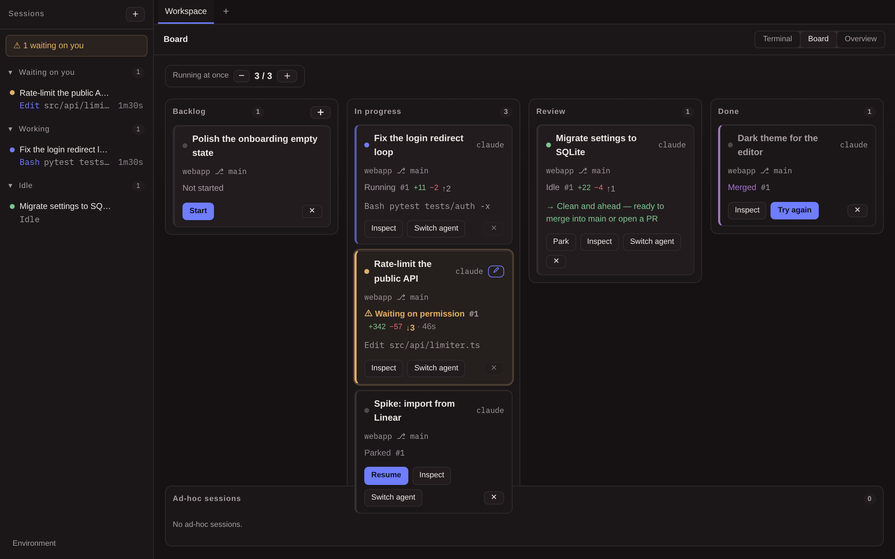
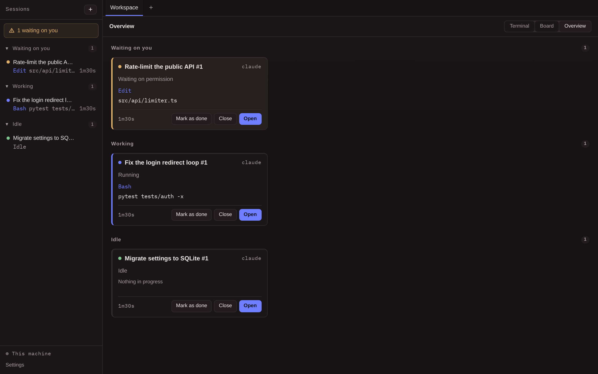
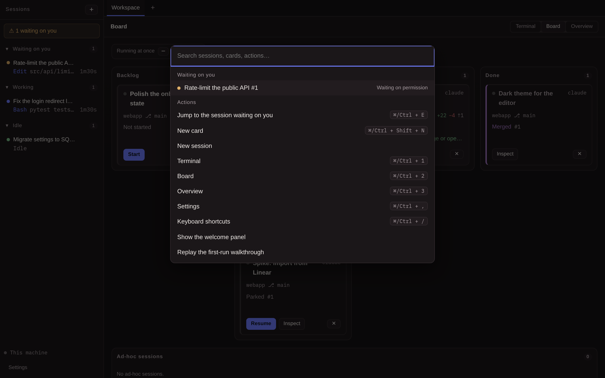
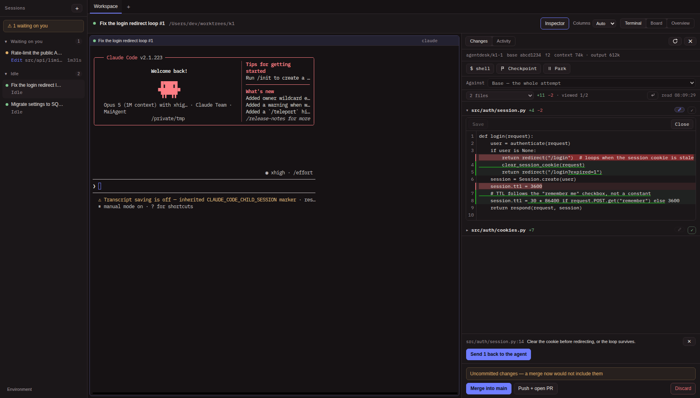
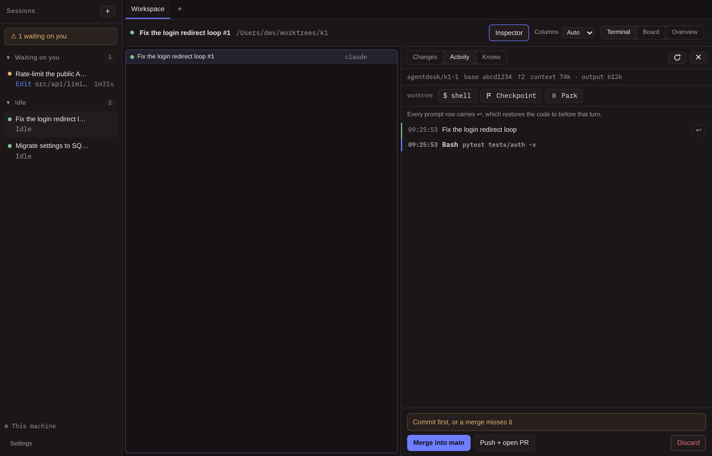
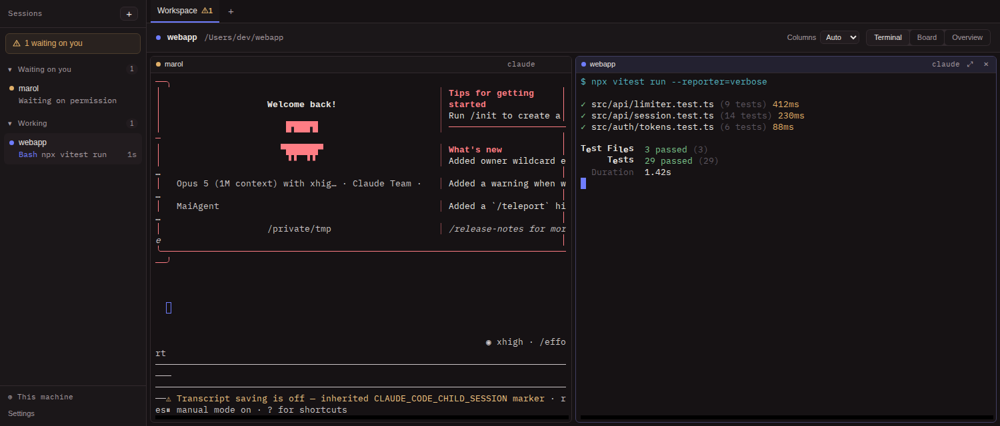
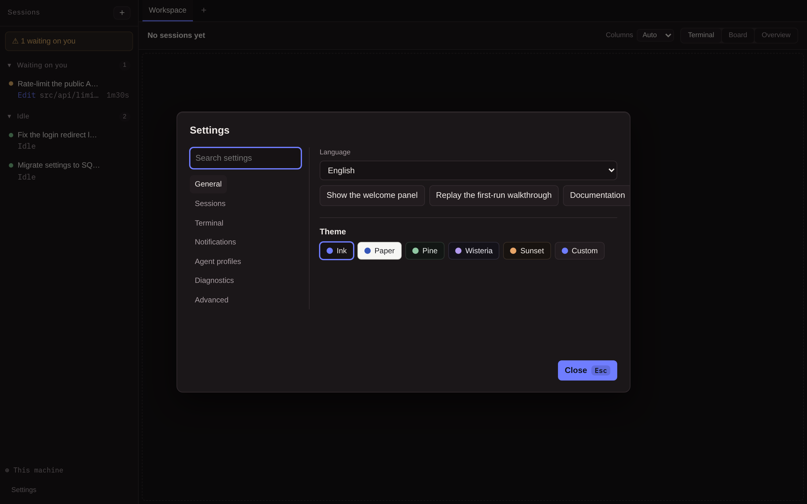

# Marol

**English** · [繁體中文](README.zh-TW.md)

A desktop console for running several coding agent sessions at once. **Every
session is a real terminal** running a real `claude` (or codex / gemini /
aider), and it looks exactly like it does in Terminal.app: same TUI, same `/`
menu, same permission prompts. The app does not repaint or reinterpret
anything.

What it adds is what terminal tabs cannot give you. Each card gets its own git
worktree, so two agents on the same repository never collide. Each session
reports whether it is blocked on you, so the one number worth knowing is on
screen. And the whole thing runs in the same environment your shell does, so
the agent finds the same tools you do.



---

## A tour, one clip per thing

### Triage

Something turns amber. Nothing else on the desk pulses, so there is no reading
involved. `⌘/Ctrl+E` puts you in that session's terminal with the cursor
already inside it.


### Compose

`⌘/Ctrl+K` opens with the sessions waiting on you already listed, before you
type anything: an attention inbox first, a search box second. Type a sentence
instead and it becomes a card.


### Start an attempt

The dialog shows the whole composed prompt and lets you edit it, so what runs
is what you read. The permission mode is chosen here, for this attempt only.
Starting opens an isolated worktree and a real terminal in it.


### Review

The diff opens beside the live terminal, not instead of it. Click a line to
attach feedback; the batch goes back through the session's own input as one
message, so the agent receives a review rather than a stream of fragments.


### Fix it yourself, in the diff

The commonest ending to a review is a one line fix, so the diff makes it. `✎`
opens the file in place, saving writes into the attempt's worktree, and a
"tell the agent" note names the file you touched.


### Knows

What the agent had already read before anyone typed: rules files and skills,
from this checkout and from this machine. The ones that do not exist are
listed too, because "no CLAUDE.md here" is the answer you came for.


### Settings

Searchable by what a thing is called on screen rather than by which drawer it
lives in. Settings that deliberately do not exist say so where you looked for
them.


---

## The other screens

<details>
<summary>Overview, palette, inspector, timeline, terminal wall</summary>

**Overview.** Every session at once, grouped by what it needs from you, and
separated by machine when more than one is involved.



**Command palette.** Waiting sessions first, then finished-and-unseen, then
cards and actions.



**Inspector.** The diff with an in-place editor open (base copy inline and
read only, worktree side editable), the attempt's token account, a pending
review comment, and the merge path's own checks run before the click.



**Activity and checkpoints.** What the agent did, rolled up by tool, with the
wait before each turn priced. Every prompt row carries `↩`, which restores the
code to before that turn.



**Terminal wall.** Every session is a real PTY: the real Claude Code TUI,
pixel for pixel, beside a plain test runner.



**Settings.** Sections, search, and the refusals.



</details>

---

## What is in it

- PTY sessions: a real pseudo-terminal running a real agent CLI, rendered by
  xterm.js
- Login-shell environment resolution, so agents get the same PATH your
  terminal has
- A SQLite session list that survives restarts; reopening a session runs
  `--continue` to resume that directory's conversation
- Multiple workspace tabs, each keeping its own layout and scrollback
- Any agent CLI with any launch arguments, passed through untouched
- **Status detection and notifications** via Claude Code hooks rather than by
  parsing ANSI. The top left shows "⚠ N waiting on you", and a blocked session
  raises a native notification
- **Tasks and attempts**: one card can have several attempts, each with its
  own git worktree and branch, so two agents on the same repo never collide.
  Finishing an attempt freezes its diff into the database before the worktree
  goes back
- **The board**: four columns, cards drag between them. A card carries its own
  live state, so a card sitting in "in progress" can light up with "⚠ waiting
  on permission", and clicking it drops you into that session's TUI. Every
  card is the same height, so the board stays scannable while its cards change
  under you. There is a separate ad-hoc session area, off the board, with no
  worktree and no lifecycle
- **Changes and activity**: a drawer beside the TUI that says what this attempt
  changed (uncommitted and new files included) and what it did, without going
  into the terminal
- **Finishing and concurrency**: merge into base, push and open a PR, or
  discard. A limit on how many run at once (3 by default); cards over the
  limit queue and start themselves when a slot frees
- **The review loop**: click a line in the diff, attach feedback, and send the
  batch into the still-open session through the session's own terminal
  (bracketed paste), so a multi-line review arrives as **one** message and the
  timeline records what was actually asked. A CLI whose input conventions have
  not been measured gets a copy button instead of a send button, the same
  honesty the first prompt has. Merging one attempt marks the card's other
  open attempts superseded, with their diffs frozen so the two agents' work
  can still be compared
- **Workspace scripts**: a fresh worktree is a checkout, not a workspace.
  `.marol/config.json` says how it becomes one (see below)
- **Permission modes**: per attempt, Claude Code can ask as usual, auto-accept
  file edits (`--permission-mode acceptEdits`), or run unprompted
  (`--dangerously-skip-permissions`). The worktree is the safety argument, so
  the choice exists for attempts and never for ad-hoc sessions. Approved once
  in the start dialog, it survives queueing and resumes, and the card wears a
  ⚡ badge for as long as the session runs unprompted
- **Named profiles**: a profile is a name for "this CLI, with these flags,
  every time", such as `opus 版` for `claude --model opus`. What is recorded
  and resumed is the CLI underneath, so prompt delivery, status hooks and
  permission modes all behave by what actually ran
- **Cross-session messaging, by card name**: Claude Code v2.1.224+ lets your
  sessions message each other on one machine, and every Marol session is a
  real `claude`, so this works between cards out of the box. What the desk
  adds is the name. Left alone the CLI names a session after its worktree
  directory, a slug with a counter, so Marol passes `--name` with the
  session's own title and one card's agent messages another's as
  「修好登入 #1」. Sent messages land on the Activity timeline. Version-gated by
  probing `claude --version` once at startup, because an older CLI refuses to
  start on an unknown flag
- **Sessions that outlive the app**: agent sessions are held in `tmux`, one
  socket each, in whichever world they run in — this machine, a WSL distro, or
  an SSH host. Quitting Marol detaches; it does not kill. Reopening the
  card attaches to the agent that has been running the whole time (see below)
- **The WSL bridge**: a card's repository can live inside a WSL distro, and
  everything runs where the repository is
- **The SSH host**: the same seam across a wire, using the `Host` aliases from
  your own `~/.ssh/config`
- **A system tray icon**: the waiting count, and a way back into the window,
  for when the window is closed. It earns its place mainly on Windows, where
  there is no dock badge at all
- **English and 繁體中文**, following your system language and switchable from
  settings. Native notifications and the tray menu follow the same setting

---

## Sessions that outlive the app

Agent sessions run inside `tmux`, one socket per session. Quitting Marol
detaches the client; the agent keeps going. Reopening the card attaches to the
process that never stopped, mid-turn work included.

Five decisions worth naming:

- **`new-session -A -D` is create-or-attach**, so "open it for the first time"
  and "reattach after a restart" are one code path and cannot disagree.
- **Quitting detaches; closing a session destroys.** That distinction is the
  whole feature: quitting the app is not the same as being finished.
- **Only agent sessions are held.** A run script or a worktree shell is
  something you opened to watch, and it goes when the desk does. An agent is
  something you opened to let run.
- **The socket name carries a per-install tag** (an FNV-1a of the data
  directory), so one installation's orphan sweep can never kill another's live
  agent.
- **Persistence is a property of the world, not a premise of the app.** A
  world with `tmux` gets it; a world without keeps exactly the behaviour it
  had, which on a fresh Ubuntu under WSL is most of them. Nothing is
  installed on your behalf, here or anywhere.

### Every world, not just this one

The same holds inside a WSL distro and on an SSH host, and the only thing that
had to change is how the socket is named. `-L <name>` asks `tmux` where its
own socket directory is, and only this machine can answer: over there the
directory depends on a uid and a profile this side cannot see, so a sweep that
guessed would look into an empty directory and conclude every live agent had
died. In another world the app names the path instead — `~/.marol/s/` —
and tells `tmux` with `-S`. Locally it stays `-L`, because moving it would
strand every session an older version left running under a name nothing looks
for any more.

Three things follow from that one change:

- **The config goes into the world.** `tmux` does not complain about a `-f`
  file that is not there; it starts on its defaults and draws a status line
  over the agent's terminal. So a config the app could not write means the
  session is not held at all, rather than held by a `tmux` that repaints.
- **The socket name carries a machine id too, out there.** Two laptops
  belonging to one person have the same data directory. If both reach one SSH
  host they would agree on a tag, and one desk's orphan sweep would kill the
  other's running work in silence. A random id, written once into the data
  directory, is what tells them apart.
- **Ending a remote session unlinks its socket in the same command.** There is
  no second visit: this process cannot reach that filesystem, and `tmux`
  leaves the inode behind when a server exits, so a leftover file and a live
  server look identical on the next sweep.

A held session comes back as **Running, not reporting** — the agent is
running, and nothing more is known yet, so its dot stays neutral. Locally that
is settled with `tmux has-session` before the first paint rather than on a
background thread: a status that corrects itself a moment later is a flicker,
on the one surface whose job is to be believed at a glance. Every other world
is asked on a thread, because asking costs a probe of that world first — a
login shell, and over SSH a connection — and a board that will not paint until
a laptop has finished talking to a server is the worse of the two. A world
that does not answer is left entirely alone: off the VPN is not the same as
gone.

It does not stay that way. **The hook endpoint is the same one across
restarts**: the port is asked for again by number and the token is kept, so
the URL baked into a running session's plugin config still resolves, and the
agent's next event puts a real status back on the row. That baking is why the
endpoint has to be stable rather than the URL indirect. Most of these are
`http` hooks, whose `url` is a literal string with no shell behind it, and
Claude Code reads the file once when the session starts. For a session already
running, that file is a photograph, not a pointer.

Two consequences worth naming:

- **Reattaching is not starting.** `new-session -A -D` attaches to the running
  agent and drops the argv, so no `SessionStart` fires. Claiming 啟動中 there
  would have been the same lie the status label used to tell, told from the
  other side, and it would never have corrected itself.
- **If the port is taken**, by a second Marol or by anything else, a fresh
  one is used and the sessions the last run left behind stay quiet for the
  rest of their lives. That is exactly where this was before the endpoint was
  remembered, so it degrades rather than refusing to start.

An SSH host reaches that listener through a reverse tunnel, so it has a second
port with the same problem, and the same answer: the remote port is remembered
per host, and failing that derived from the host name and this machine's id.
Both halves matter — the host so one desk's two servers do not collide, the
machine because the port is bound on the *remote* side and two laptops
reaching one server would otherwise ask it for the same one. `ssh -f` forks
after authentication and exits 0 even when the forward was refused, printing
into a stderr nobody reads, so `ExitOnForwardFailure` is set: a refused port
is an answer, and the next candidate gets tried.

---

## The tray

An icon that says whether anything is waiting on you, and a way back into the
window when the window is gone. `⚠ 3` beside the icon where the platform draws
a label, the same thing in words on hover where it does not, and nothing at
all while nothing waits: a tray that always says its own name spends a
permanent slice of the menu bar to tell you something you knew.

It is mostly for Windows. macOS and Unity put the waiting count on the dock
icon already, so there the tray repeats a thing that has been said; on Windows
there is no badge, and a closed window used to mean no signal of any kind that
an agent was blocked.

Three things it deliberately does not do:

- **Closing the window still means what your platform says it means.** Making
  close mean hide is a thing tray apps do, and it surprises everyone who meant
  to quit. It is also less needed than it used to be, now that quitting is
  cheap: the agents outlive it.
- **Quitting from the tray is the same quit.** It goes through the same exit
  path as every other, so tmux-held sessions are detached rather than
  orphaned, and the hook port is given back for the next run to take.
- **The menu does not list the waiting sessions by name.** That is a real idea
  and a larger one: it needs the list rebuilt on every state change and a
  click route back into the webview. The count already answers the question
  the tray exists to answer, which is whether to go and look.

---

## Making worktrees runnable

Put `.marol/config.json` in a repository and every attempt's worktree sets
itself up:

```json
{
  "setup": "npm install && cp \"$MAROL_ROOT_PATH/.env\" .env",
  "run": [
    { "name": "dev", "command": "npm run dev -- --port $MAROL_PORT" },
    { "name": "test", "command": "npm test -- --watch" }
  ],
  "archive": "docker compose down"
}
```

`setup` runs before the agent starts, in the same terminal, so its output and
its failures are where you are already looking. `run` entries become ▶ buttons
in the drawer that start a dev server or test watcher in that attempt's own
worktree, with a free port in `$MAROL_PORT`. `archive` runs just before
the worktree is taken back. Every script sees `$MAROL_ROOT_PATH`, the
repository the worktree was opened from, where untracked files worth copying
(`.env`) live.

Scripts run through `sh -c`, written exactly like a line in a terminal. A
malformed file fails the attempt start in the dialog rather than silently
doing nothing, because a config that quietly did nothing would be
indistinguishable from a broken worktree. (POSIX platforms only for now.)

`.agentdesk/config.json` and `$AGENTDESK_*` still work, and will keep working.
That file is the one thing this app renamed that is not its own: it lives in
*your* repository, it is usually committed, and your collaborators may not run
this desk at all. Both variable names are set to the same values, so a
repository can be brought forward whenever it suits you, or not at all.

---

## Running it

You need Node 20+, Rust stable, and the agent CLI you intend to use installed
and signed in.

```bash
npm run setup
npm --prefix ui run dev &                       # vite on :5173
cargo run --manifest-path src-tauri/Cargo.toml
```

If `cargo` is not on your PATH, run `source ~/.cargo/env` first. To make it
permanent, add this to `~/.zshrc`:

```sh
export PATH="$HOME/.cargo/bin:$PATH"
```

### Around the loop

The pieces that carry the triage loop, in roughly the order you meet them:

- **First run** lands on the board, whose empty backlog is the door in. The
  welcome panel reports which agent CLIs this machine actually has and teaches
  card → attempt → finish as a three-dot rail drawn with the board's own dot
  shapes. A machine with no agent CLI on its PATH gets an honest amber dead
  end with a "Probe again" chip, not a cheerful blank. The panel reopens any
  time from the palette or settings, and reopening probes again rather than
  replaying a stale answer. After that, five one-shot coach marks point out a
  surface the first time it matters and then never again. The fifth teaches
  the amber breath and `⌘/Ctrl+E` the first time a session turns from working
  to waiting. Until the first session ever opens, the empty terminal wall
  shows a three-row keymap card rather than nothing.
- **Unseen tier.** A session that finishes a turn while its terminal is not in
  front of you wears an unread dot in the sidebar, the tab badge and the
  overview until that terminal has been on screen.
- **Sidebar sections.** Waiting on you first (the same set the ⚠ badge
  counts), then working, idle, done. Idle is its own tier: a turn that ended
  is your move, but nothing is blocked on you.
- **Board live peek.** Selecting a card shows its real terminal beside the
  columns, read only until you enter it, so "what is it doing right now" costs
  one click and no navigation.
- **Inspector** (`⌘/Ctrl+I`). The attempt's diff with per-file viewed state,
  wrap, file jump and a resizable drawer; a timeline that rolls up tool runs
  and prices each wait; a shell tab opening a real terminal in the attempt's
  worktree; and a suggested next action read off git, shown only when a human
  decision is plausible.
- **Queued follow-up.** Feedback written while the agent is mid-turn holds
  until the turn ends, then sends as one message. A banner names what is
  queued and cancels in one click.
- **Checkpoints.** A cheap way back is what buys an agent room to run: it is
  easier to let one work unattended when the worst case costs one click. Every
  turn's end snapshots the worktree into a private ref (default on, off in
  settings), touching nothing the agent sees, plus a manual ⚑ for any agent.
  Prompt rows on the timeline wear `↩`: restore the code to before that turn.
  The conversation is never touched, a pre-restore snapshot is kept first, and
  a turn in flight refuses with its reason. The diff can compare against any
  checkpoint. Refs die with the attempt; the frozen diff remains the record.
- **Parking.** "Not now" without "never": park a settled attempt to give its
  worktree and concurrency slot back while the branch, checkpoints and
  conversation all stay (the branch name lands on your clipboard). Resume
  grows the worktree back at its old path, restores the parked work, and
  `--continue` picks the conversation up where it left off.
- **One loud action per card.** A stopped card keeps Resume loud and reveals
  park and switch-agent only when the card is aimed at; a merged card's "Try
  again" no longer outshouts the win it sits under. The inspector's five
  utility chips became one labelled worktree band for the same reason: five
  equal voices is no hierarchy at all.
- **Dev server preview.** A ▶ run script's page, on the desk: an iframe beside
  the terminals showing exactly what the server sends, never proxied, never
  injected. A dead server says so instead of going blank. Opt into inspect
  (`docs/examples/marol-inspect.js`) and Alt+click turns any element into
  `{component} · {file}:{line}`, one click away from the agent's terminal.
- **Token account.** Each Claude session's spend and context, read off its own
  transcript at every turn's end (hooks carry the path; nothing is polled
  mid-turn). The inspector shows `ctx 279k · ↑2.6M` with the exact four-way
  breakdown on hover. Tokens, never dollars or percentages: a price table goes
  stale, and a context window we did not measure would be an invented
  denominator.
- **Find in terminal** (`⌘/Ctrl+F`). Search the 10k-line scrollback from a
  small overlay; Enter and Shift+Enter step through matches, a miss says so.
  From inside a terminal the chord adds Shift, since Ctrl+F belongs to
  readline. URLs in output open with ⌘/Ctrl+click.
- **Branch picker.** The new-card dialog suggests the repo's branches sorted
  by recency instead of asking you to type one from memory. The title is
  optional: left blank, the card takes the prompt's first line, a rule the
  dialog states rather than a lucky default.
- **Worlds.** The bottom-left switch picks where new cards and sessions open
  (WSL distros and SSH hosts enumerated, never invented) and probes the chosen
  world's `claude` on demand. Repos over WSL or SSH carry a host badge on
  their cards, and the overview separates sessions by machine once more than
  one is involved.
- **No-signal chip.** Status comes from Claude Code's hooks; a card running any
  other agent says "no status signal" rather than letting silence read as
  calm.

### Keyboard

The high-frequency loop, an agent waits and you authorize and you move on, can
be driven without the mouse. `⌘/Ctrl+/` shows this list in the app:

| Keys | Does |
|---|---|
| `⌘/Ctrl+E` | Cycle through the sessions waiting on you |
| `⌘/Ctrl+K` | Command palette: waiting sessions first, then cards and actions |
| `⌘/Ctrl+Shift+N` | New card, straight to the dialog |
| `⌘/Ctrl+Enter` | Submit the open creation dialog. An Enter that ends an IME composition never submits |
| `⌘/Ctrl+1` `2` `3` | Terminal wall · board · overview |
| `⌘/Ctrl+Alt+←` `→` | Focus the next / previous pane |
| `⌘/Ctrl+←` `→` `↑` `↓` | Move the focused board card: a column sideways, a slot up or down |
| `Ctrl+PgDn` `PgUp` | Next / previous tab |
| `⌘/Ctrl+I` | Open or close the inspector |
| `⌘/Ctrl+,` | Settings |
| `J` `K` | Walk the diff lines; `Enter` comments on one |
| `N` `P` | Walk the diff files; on a file's header `e` opens it in the in-place editor, `v` marks it viewed |
| `Esc` | Close the open dialog |
| `Tab` `Enter` | Session rows, board cards and diff lines are all focusable; Enter acts |

Inside a terminal the app's shortcuts take Shift, so `Ctrl+Shift+E` rather
than `Ctrl+E`, the same way `Ctrl+Shift+C` copies. `Ctrl+letter` there belongs
to the shell.

A dialog holding typed text ignores backdrop clicks (Escape still closes it),
and deleting a card takes two clicks, the second one naming what it is about
to do.

Focus is handed, never dropped: the palette lands on the card it names;
creating a card switches to the board with the new card focused and announced;
merging from an empty terminal wall lands on the freshly judged card; and
sending a review batch gives the caret back to the diff.

### Screen readers

Terminals render on the GPU (WebGL), which draws pixels a screen reader cannot
read. Settings has an opt-in terminal screen-reader mode that trades that
renderer for the DOM one: terminal text, permission prompts included, becomes
readable, and heavy output scrolls less smoothly. The setting's own hint
states that trade, because a mode promising accessibility for free would be
lying to one side or the other.

Around it, the parts of the app that speak: a card's label speaks its
permission mode, so a yolo session is never mistakable for a supervised one;
turn endings are announced through the live region; every glyph button carries
a real name; the splitters expose real values to assistive tech; and the world
menu walks by arrow keys.

### Notifications

When a session starts waiting on you, a permission prompt or a folder-trust
question, and the window is not focused, the OS shows a notification in the
app's language, and the dock or taskbar icon wears the waiting count on macOS
and Linux. With the window focused the in-app banner already says it, so the
OS stays quiet.

Settings lets you choose which classes fire (permission and trust prompts,
waiting on your reply, a turn finishing) and has a test button, because the
first time you learn a notification setting is broken should not be while an
agent sits blocked.

### Themes

Five presets, Ink (the default), Paper (light), Pine, Wisteria and Sunset,
plus a custom mode. A custom theme asks for the six colors that carry meaning
(background, text, accent, ok/warn/err) and derives the in-between tiers. The
editor shows the WCAG contrast of every text tier against the surface it
actually sits on, live, with 4.5:1 as the floor the app keeps for itself.
Terminals change clothes with the theme, including a light ANSI ramp on light
themes. The choice persists locally.

---

## Testing

```bash
cd src-tauri && cargo test      # PTY, hooks, worktrees, attempts, timeline, queue, migrations, rules, storage
npm --prefix ui run test:e2e    # Playwright: frontend + board + inspector + queue + xterm rendering + journeys
```

macOS ships WKWebView with no WebDriver, so Playwright runs the same React
tree in Chromium against a mocked Tauri IPC. It covers everything above the
IPC boundary: the session list, the new-session flow, and xterm's decoding and
rendering of **real PTY bytes**.

The tests check the properties that decide whether the experience is real, not
merely that something was output:

- `tests/pty.rs`: the child process is on a tty (so the CLI enters interactive
  mode rather than a degraded non-interactive one), and it gets the login
  shell's PATH rather than a GUI stub
- `tests/hooks.rs`: the whole chain, PTY → real `claude` → plugin hook → curl →
  HTTP listener, with the session id matching. No paid API call needed
- `ui/tests/fixtures/claude-tui.json`: real Claude Code TUI output captured
  from a PTY, **deliberately split in two through the middle of a multi-byte
  character**. A control test proves this fixture really does break under
  chunk-by-chunk decoding, so the main test cannot pass for the wrong reason
- `tests/prompt_injection.rs`: runs a real `claude` in a genuinely new,
  never-trusted worktree and counts how many times the `UserPromptSubmit` hook
  fires. A multi-line prompt must be **one** message, not one per line
- `tests/worktree.rs`: against real git, two attempts cannot see each other's
  files, their base_shas do not drift into one another, worktrees come back,
  and branches stay
- `tests/attempts.rs`: the whole core flow with a stub agent instead of a real
  model. What is checked is what Marol did (which worktree it opened, what
  the command line looked like, what it recorded, what it gave back), none of
  which needs a model to answer. The stub's log is NUL-separated, because one
  argument per line could not tell "one argument containing a newline" apart
  from "several arguments", which is exactly what is under test
- the timeline section of `tests/attempts.rs`: hook listener → router →
  channel → writer thread → SQLite. It also pins down what must *not* be
  recorded: three consecutive `running` reports leave the tool call and not
  three status rows
- the tmux section of `pty.rs`: with no client attached at all, the session is
  still there and the agent process is still running. That is the entire
  feature, so it is asserted directly rather than inferred from a reattach
- the migration section of `store.rs`: one test per upgrade path, including
  **an old database with no version but which already has `completed`**
  (getting this wrong bricks every existing install), an older one without
  `completed`, and a normal upgrade from the previous version with no data
  loss
- `ui/tests/queue.spec.ts`: a queued card starts itself with nobody pressing
  anything, and a merge that would lose work is refused with the reason
  spelled out in full
- `ui/tests/board.spec.ts`: the two axes really are independent. The card stays
  in its column while its light moves on its own from "waiting on folder
  trust" → "running" → "⚠ waiting on permission"; and after clicking,
  **`document.activeElement` really is inside that pane**, not merely that the
  pane has a focused class. The drag test fires all four drag events within
  one tick, which is stricter than a real drag: an implementation that only
  passes because React state happened to settle fails outright
- `ui/tests/layout.spec.ts`: across seven viewport sizes, nothing is drawn on
  top of anything else, the page never scrolls sideways, and no two board
  cards differ in height by more than a pixel. The first check names the cause
  (a grid squeezed shorter than its content) rather than only the symptom,
  because the symptom needs tall cards to be visible and the cause never hides
- `ui/tests/i18n.spec.ts`: the language follows the system when nothing has
  been chosen, a stored choice beats the system, switching re-renders live and
  survives a reload, and the choice reaches the backend so native
  notifications match
- `ui/tests/journeys/`: five real usage lines walked end to end rather than
  screens poked in isolation. A first run from cold start to merge; a
  zero-mouse triage day, whose spec contains no `.click` at all, so the
  keyboard claim is enforced by construction; restart recovery; the
  accessibility contract under reduced motion; and the whole first line again
  in 繁體中文. Six visual baselines beside them pin the key screens

The two tests that drive a real `claude` (`tests/hooks.rs` and
`tests/prompt_injection.rs`) skip themselves when there is no signed-in CLI to
drive. Being on `PATH` is not enough to check: a CLI nobody has signed into
comes up on its welcome flow and never starts a session, so the test would
burn its full timeout proving only that this machine has no login. They read
`hasCompletedOnboarding` from Claude Code's own `~/.claude.json` instead. If
that key ever moves they start skipping rather than start passing wrongly, and
the skip says why on stderr. `MAROL_TEST_ASSUME_CLAUDE=1` runs them anyway.

### README media

The screenshots and clips above are the real React tree, the real stylesheet,
and xterm rendering a real captured Claude Code TUI. Only the backend is the
same mock every test trusts, so the data is staged and the pixels are not.

```bash
SHOTS=1 npm --prefix ui run test:e2e -- shots            # docs/media/*.png
CLIP_DIR=.rec npm --prefix ui run test:e2e -- clips      # record
node ui/scripts/readme-clips.mjs                         # docs/media/clips/**/*.gif
```

Each clip gets its own palette. One global palette for a whole demo is why the
old recording drifted in colour: 256 slots had to cover a terminal's syntax
highlighting, the four status hues and the diff's red and green all at once,
so everything shifted toward whatever dominated. A clip shows one feature, so
its palette holds one feature's colours.

---

## Release

Installers for all three platforms are produced by GitHub Actions
(`.github/workflows/release.yml`).

Cutting a release is one click and one decision: **Actions → Release → Run
workflow → pick a `bump`**, `patch` for fixes, `minor` for features, `major`
for breaking changes. The run computes the next version, writes it into
`tauri.conf.json`, `Cargo.toml`, `Cargo.lock` and `package.json`, commits that
to `main`, builds all four platforms from that commit, and publishes. Nobody
maintains the version number by hand, so it moves on every release by
construction.

Then: create a draft release, build all four platforms in parallel, and
**publish only when every one is green**. If a platform fails it stays a
draft, so nothing half-built ships. The version guard still protects the
manual paths: pushing a tag (or dispatching with the explicit `tag` input)
fails outright unless the tag matches `tauri.conf.json`, rather than shipping
a `v0.2.0` release full of `Marol_0.1.0_*` files. The explicit `tag` input
is also the recovery path, since a release that failed after its bump commit
landed is re-cut with the tag it already burned rather than bumped a second
time.

### Nightly builds

Every push to `main` runs the same four-platform build and publishes it to a
rolling prerelease tagged `nightly`, replacing whatever was there before. So
the newest build of `main` is always one click away without waiting for a
version to be cut:

    https://github.com/KCL1104/marol/releases/tag/nightly

It is a prerelease and never marked "latest", so it cannot displace a real
version on the repo's front page or in the release API. If any platform fails,
the draft is discarded and the previous nightly stays up rather than a partial
one shipping. Pushes that land while a build is running supersede it, since
only the newest commit's binaries are wanted, whereas a tag build is never
cancelled.

This is why `ci.yml` does not build installers: it used to bundle three
platforms on every push to main and throw them away.

No release path pushes a tag over git. GitHub creates the tag at the built
commit when the release publishes, the same way the nightly's tag is made.
Dispatching with both inputs empty only builds; the artifacts hang off the run
and no release is touched. Every run attaches artifacts that way regardless,
so tagged and nightly builds are also downloadable from the run itself.

| Platform | Runner | Artifacts |
| --- | --- | --- |
| Linux x86_64 | `ubuntu-22.04` | `.deb`, `.rpm`, `.AppImage` |
| macOS Apple Silicon | `macos-15` | `.dmg`, `.app` |
| macOS Intel | `macos-15-intel` | `.dmg`, `.app` |
| Windows x86_64 | `windows-latest` | `.msi`, NSIS `.exe` |

Linux builds on 22.04 rather than 24.04 because glibc and WebKit are only
forward compatible: something built on 24.04 will not run on 22.04.
`macos-15-intel` is the last x86_64 macOS image Actions will offer; it retires
in August 2027, and the Intel row goes with it.

Only half of the `.deb` and `.rpm` dependencies appear by themselves. The
bundler reads the shared objects the executable actually links against and
adds `libwebkit2gtk-4.1-0` and `libgtk-3-0`. **`git` is not one of them**: it
is invoked at runtime through `Command::new("git")`, not linked, so nothing
can detect it. That one is written by hand in `bundle.linux.deb.depends` in
`tauri.conf.json`; without it the package installs cleanly and then falls
apart the moment you use a worktree. `gh` sits in `recommends`, since only the
open-a-PR path needs it.

### Nothing is signed

There are no signing keys in this repository, so artifacts on all three
platforms are unsigned. The first launch will be blocked:

- **macOS.** Gatekeeper says the app "is damaged and can't be opened". It is
  not damaged; that is the quarantine attribute:

  ```bash
  xattr -dr com.apple.quarantine /Applications/Marol.app
  ```

- **Windows.** The blue SmartScreen dialog: "More info" → "Run anyway"
- **Linux.** Nothing blocks you

To sign, add `APPLE_CERTIFICATE`, `APPLE_CERTIFICATE_PASSWORD`,
`APPLE_SIGNING_IDENTITY`, `APPLE_ID`, `APPLE_PASSWORD` and `APPLE_TEAM_ID` to
the repository secrets, then pass them through as `env` on the build step in
`release.yml`. There is a comment there marking the spot.

They are deliberately **not** wired in ahead of time. The bundler decides to
sign whenever `APPLE_CERTIFICATE` *exists*, empty value included; it never
checks for a non-empty one. Referencing a secret this repository does not have
therefore sets it to `""`, and both macOS jobs die with `failed codesign
application: failed to import keychain certificate`. Add the variables in the
same change as the real secrets, not before.

### Icons

The `.ico`, `.icns` and assorted PNGs under `src-tauri/icons/` are committed,
not generated in CI. Windows needs the `.ico` and macOS needs the `.icns`;
without one, that platform cannot produce an installer at all. To change the
artwork:

```bash
npm run tauri -- icon path/to/new-icon.png
```

Its default output directory is `src-tauri/icons/`, and it **overwrites the
source `icon.png` along with everything else**. To keep the original, send it
somewhere else with `-o` first and copy back the files you need.

---

## CI

`.github/workflows/ci.yml`. Runs on pushes to main and on every PR: Rust
`cargo test`, frontend typecheck and build and Playwright, sidecar typecheck
and build. Correctness only. Packaging is release.yml's job, and a push to
main proves it by producing installers people can actually download rather
than by building them and deleting them.

`cargo fmt` and `clippy` **do not gate CI**; they only report. This tree is
not rustfmt-clean, and reformatting the whole thing is a separate change that
should not be tied to wiring up CI.

`npm run smoke` is not in CI: it opens a real Claude Code session and needs
credentials.

`.github/workflows/claude-detect.yml` guards the one claim the rest of CI
cannot: that the app finds a real Claude Code on a real machine. Four legs,
Linux, macOS, native Windows and Ubuntu under WSL, install the real CLI on a
real runner, then drive the app's **own** resolution path (the login-shell
probe, the platform's PATH walk, the WSL doorway) until it finds the binary
and gets an answer out of `claude --version`. It runs on every push to `main`
touching `src-tauri` and every Monday, because the upstream installer can
change shape without any commit here, and a Monday failure with a green tree
points at them.

---

## Language

The interface ships in English and 繁體中文.

It opens in whichever your system asks for (any `zh*` locale gets Chinese,
everything else gets English) and settings has a picker. A choice made there
always beats the system setting and is remembered across restarts.

The webview owns the decision and pushes it down to Rust through `set_locale`,
so the handful of strings the OS renders rather than the webview, native
notification titles and bodies, follow the same setting. Two independent
detection rules that could disagree would be worse than one that is simply
told.

Interface strings live in `ui/src/i18n/messages.ts`. English is the source of
truth: its keys define the `MessageKey` type and the Chinese catalogue is
typed as a total map over it, so a key added to one language and forgotten in
the other fails the typecheck rather than silently rendering a raw key on
screen. The few strings Rust renders itself are in `src-tauri/src/i18n.rs`.

The interface says what a control does. It does not explain git, shells or
CLIs back to the person using it: an error names what happened and stops
there, and the reasons live here and in the first-run walkthrough, which is
read once on purpose rather than every time a mistake is made.

Code comments are deliberately left in Chinese. They are written for whoever
works on this, not for whoever runs it, and the reasoning they carry is the
most valuable thing in the repository. Translating it is a different job from
making the product bilingual.

---

## Status detection

With several sessions open, the only thing you genuinely need to know is which
one is waiting for you. That comes from asking Claude Code to report it, not
from parsing the screen, because parsing ANSI breaks silently whenever the TUI
changes.

At startup the app does two things: opens a small HTTP listener on loopback,
and writes a hooks-only plugin into its data directory. Every session loads it
with `--plugin-dir` and gets `MAROL_SESSION_ID` and `MAROL_HOOK_URL`
injected; the hook is a one-line `curl` reporting the status back.

| Hook event | Reported status |
|---|---|
| `SessionStart` / `UserPromptSubmit` / `PreToolUse` | running |
| `PermissionRequest`, `Notification`(permission_prompt) | **waiting on permission** |
| `Notification`(idle_prompt) | **waiting on you** |
| `Stop` | idle |
| `SessionEnd` | ended |

Only "waiting on permission" and "waiting on you" raise a notification and
count towards the badge. Those are the two states where the agent really is
blocked and cannot continue without you.

Three implementation landmines, all found by measurement and none of them
documented:

1. **You cannot inject hooks with `--settings`.** It overwrites keys of the
   same name, which switches your own hooks off entirely. Plugin hooks are
   additive.
2. **`"shell": "sh"` makes hooks silently not fire.** No error, no report.
   `"bash"` works, and so does leaving it out. There is a regression test
   pinning this.
3. **A hook must exit 0.** Exit code 2 **blocks** the tool call it is attached
   to, so every line ends with `|| true`. The app breaking must never wedge
   the agent along with it.

(Three more measured findings, about worktrees and the first prompt, are under
"Tasks and attempts" below.)

---

## Tasks and attempts

`Task 1 ─ N Attempt 1 ─ 1 Session`. An attempt is one go at a card with one
agent, carrying its own worktree and branch; switching agent and retrying
means opening a new attempt.

State has two axes, and **the second never drives the first**:

| Axis | Contents | Who decides |
|---|---|---|
| 1 · task lifecycle | `backlog → running → review → done` / `abandoned` | only a person, by dragging |
| 2 · live session status | running / ⚠ waiting on permission / ⚠ waiting on you / ⚠ waiting on folder trust / idle / running unwatched / ended | reported by hooks |

This follows the position `store.rs` already took with `completed`: `Stop` only
means this turn ended, not that the work is done, so no hook can move a card.

Worktrees live in `~/.marol/worktrees/<repo>-<hash>/<slug>-<n>/`, **not
next to the repo**. A repo's parent directory is very often a repo itself (an
umbrella workspace), and a worktree placed there becomes a nested repo, at
which point every tool that walks upwards looking for `.git` starts giving
different answers. Nor under application support: this is a working directory
that people want to `cd` into, open in an editor and run builds in, and "a
path you can type" is worth more than "tidy".

Three more measured, undocumented facts (pinned by
`tests/prompt_injection.rs`):

4. **Passing the prompt as a positional argument does not degrade into print
   mode**; `-p` does. A multi-line string passed through argv arrives as
   **one** message, since a newline in argv is text, not Enter.
5. **A new worktree always hits the trust dialog, and nothing runs until it is
   answered, not even `SessionStart`.** So no hook can report this state; the
   core marks it `AwaitingTrust` directly, which it is entitled to do because
   it created that directory a moment earlier. Without this the badge misses
   the first state of every attempt. The prompt itself survives the dialog and
   is sent once you answer.
6. **`$SHELL -ilc` inherits Marol's own environment.** Launched from Finder
   that is clean; launched from a terminal inside a Claude Code session it is
   not, because `CLAUDE_CODE_CHILD_SESSION` switches transcript saving off, so
   `--continue` has nothing to resume and reopening an attempt silently starts
   from scratch. `shell_env` strips session markers like this, but **only the
   ones explicitly listed**: `CLAUDE_CODE_*` also houses real user settings
   such as `CLAUDE_CODE_USE_BEDROCK`, and cutting by prefix would break
   someone else's environment.

The first prompt injects only what the agent cannot discover for itself: that
this is a worktree opened for this card, which branch it is on, which base it
came from, and that commits go on this branch. CLAUDE.md, skills and MCP all
load natively and are not repeated. The template lives at
`<data_dir>/prompt-template.md`, can be edited, and upgrades do not overwrite
it. The start-attempt dialog shows the full prompt and lets you edit it, and
what is recorded is what was sent.

Non-Claude agents do not get the prompt sent automatically. Those CLIs'
argument conventions have not been measured, and a flag meaning "here is your
prompt" in one can mean "print this and exit" in another. Guessing wrong is
worse than not guessing, so the UI shows the assembled prompt with a copy
button.

---

## Architecture

```
Tauri window (React + xterm.js)
      │  invoke: term_write / term_resize
      │  event:  term:output
Rust core  ── PTY registry · session list · SQLite
      │  portable-pty (agents held in tmux, one socket each, per world)
  claude / codex / … × N
```

The core (`src-tauri/src/core.rs`) does not depend on Tauri; it talks outwards
only through the `UiSink` trait, so adding an axum websocket later to let a
browser or a remote client connect would not mean rewriting it.

### Why resolve the login-shell environment

A GUI program launched from Finder or the Dock gets a stripped environment:
`PATH` is roughly `/usr/bin:/bin:/usr/sbin:/sbin`, with no nvm/mise/asdf
shims, no Homebrew prefix, and none of the API keys you exported. Hand that to
a coding agent and `npx`-style MCP servers fail to start, and often the agent
itself cannot even be found.

`shell_env.rs` runs `$SHELL -ilc 'env -0'` once at startup and spawns every
session from your own shell's environment. The diagnostics section in settings
shows what was resolved, and says so plainly when it had to degrade.

The same resolution used to fail on native Windows for a different reason:
environment keys there are case-insensitive and the registry writes `Path`,
not `PATH`, so an exact-name lookup found nothing and the machine could not
see `claude`, or anything else, at all. Since v0.3.1 the keys are read the way
Windows means them.

### Terminal output is bytes, not strings

Read boundaries from the PTY land wherever the kernel decides. Decoding each
chunk as UTF-8 on the Rust side turns any multi-byte character straddling a
boundary into U+FFFD, and a TUI is full of 3-byte box-drawing characters, so
the screen splits along chunk boundaries. Output is therefore passed as base64
and handed to xterm's own stateful decoder, which stitches the boundaries back
together.

For the same reason `lineHeight` must be exactly 1. Anything greater leaves
gaps between rows, and the box-drawing characters stop joining up.

### The PTY starts producing output before the pane mounts

A PTY starts emitting bytes the moment it spawns, but the pane that displays
it does not exist until the next render. Everything in between, which for
Claude Code is the entire opening screen, would go to nobody, leaving the pane
blank.

So the Rust side keeps a bounded scrollback and a sequence number per session.
When a pane mounts it subscribes first (so nothing is missed), then takes a
snapshot, then writes the snapshot and replays only the live chunks newer than
it. The other order loses what arrives in between; not comparing sequence
numbers writes it twice.

That same protocol is what makes reattaching to a held tmux session work: a
pane arriving late is a pane arriving late, whether it is late by one render
or by one app restart.

### Why PTY rather than the Agent SDK

The SDK version was built first: structured events, a native message stream
and tool cards, `canUseTool` intercepting permission requests into native
dialogs. It could do more, but **the screen was no longer a terminal**. Given
the goal is "identical to a terminal", a PTY is the only thing that guarantees
it, because the TUI draws itself and we only carry the bytes.

That code is parked in `src-tauri/parked/` (the Node half in `sidecar/`)
rather than deleted. If intercepting tool calls rather than merely carrying
them is ever needed, an unattended background mode say, or a policy layer, it
is a usable starting point.

---

## Known limits

- Finishing stops at "merge" and "open PR". PR review, comments, CI status and
  the merge button are all out of scope. That is a much larger tool, and
  forcing it in here would only dilute the deepest thing this does
- Status detection only works with Claude Code. Other CLIs have no equivalent
  hook mechanism and will only show "running / closed". The first prompt is
  also only sent automatically for Claude Code; other agents get the assembled
  prompt displayed for you to paste (see above)
- The first time you open a session in a directory, Claude Code asks whether
  you trust the folder. That is its own behaviour and is deliberately not
  bypassed. **Every attempt is a new directory, so every attempt hits it
  once**
- Scrollback is not persisted, the same as a real terminal. Conversation
  history is the agent's own (Claude Code keeps it in `~/.claude/projects/`),
  and reopening reconnects through `--continue`
- **Setting an outcome is final.** The worktree is removed, so that attempt no
  longer has a live TUI. What remains is the timeline and a frozen diff. The
  same goes for superseded attempts: "kept for reference" means read-only
  reference, not somewhere you can jump back in and type
- Sessions outlive the app in any world that has `tmux`, and only those. A
  distro or host without it keeps the old behaviour: the card stops when the
  app does and needs resume pressed. Nothing is installed on your behalf
- A held session reads as **Running, not reporting** until its agent's next
  hook event lands, which for an agent sitting idle at a prompt may be until
  you type something
- A world whose every card was deleted keeps its sockets until you open a card
  there again. Reaching an SSH host opens a connection to it, and opening one
  nobody asked for to tidy up is worse than a few files in a directory of ours

---

## Upgrading from AgentDesk

This app used to be called AgentDesk. Updating carries everything over:

- **Your board comes with it.** The state directory is renamed on first run —
  database, machine id, remembered hook endpoint and tunnel ports. Nothing
  outside it points in, so the rename is just a rename. If a Marol directory
  is already there it wins and is never written over
- **Worktrees stay exactly where they are**, in `~/.agentdesk/worktrees`, and
  the desk goes on using that directory for as long as it exists. These paths
  are written into the attempt rows that opened them *and* into each
  repository's own git admin files; moving them would break both ends. New
  installs get `~/.marol/worktrees`, and so does this one once the last of the
  old trees is handed back
- **Agents tmux is holding keep running, and are reattached rather than
  restarted.** Their sockets are under the old name; asking for the new one
  would have started a second agent in the same worktree
- **`.agentdesk/config.json` and `$AGENTDESK_*` keep working** — see
  [Making worktrees runnable](#making-worktrees-runnable)

---

## License

Apache-2.0. The full text is in [LICENSE](LICENSE).
