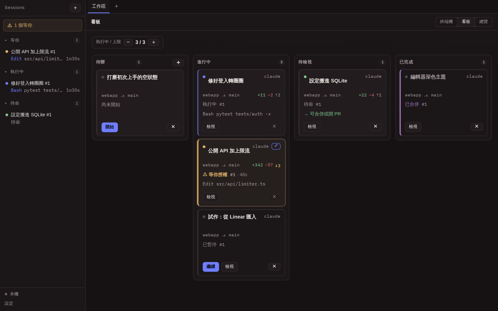
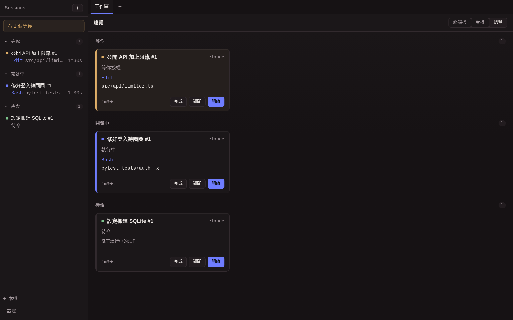
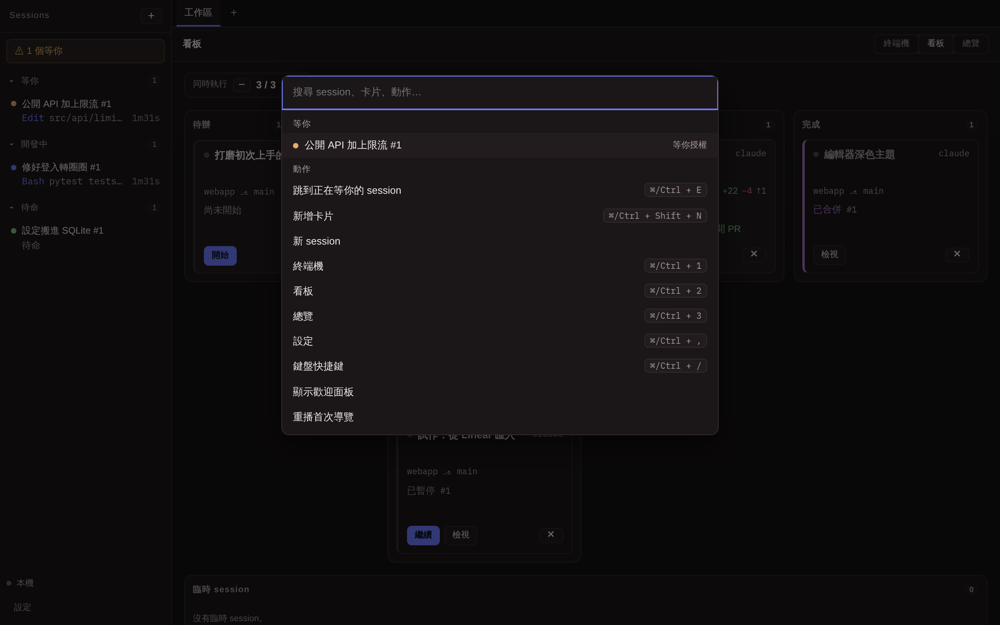
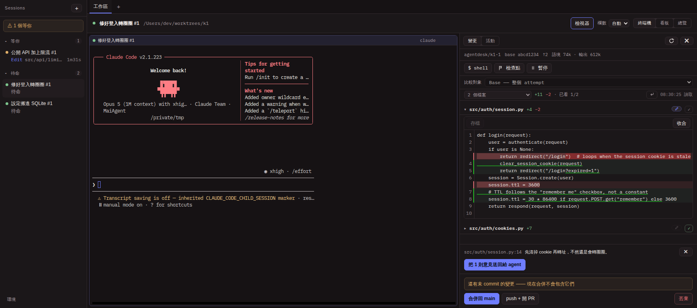
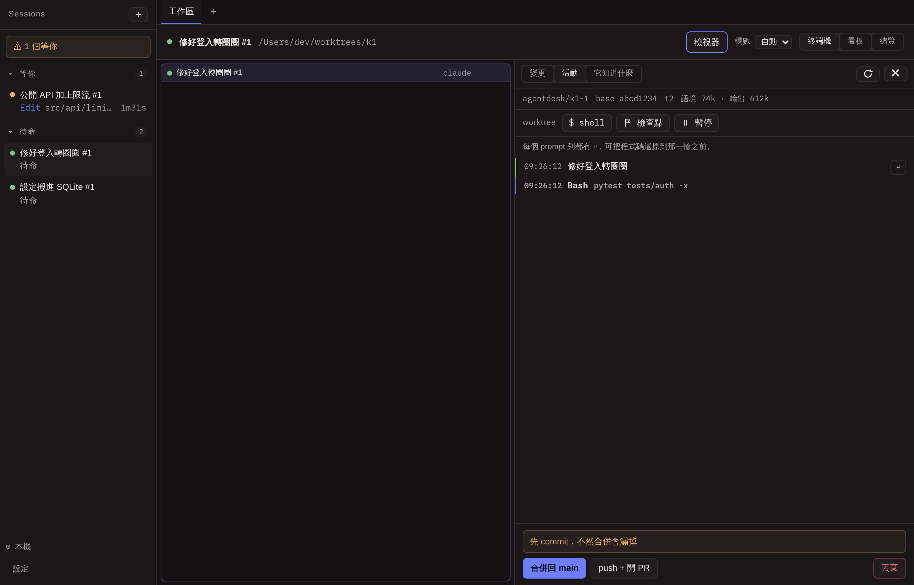
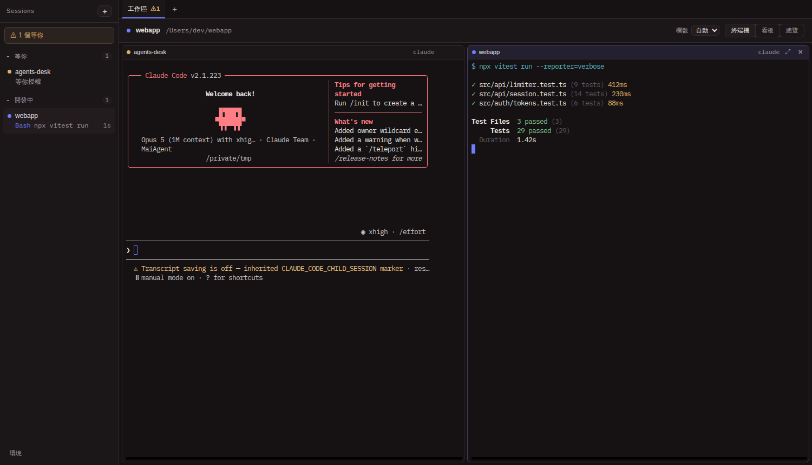
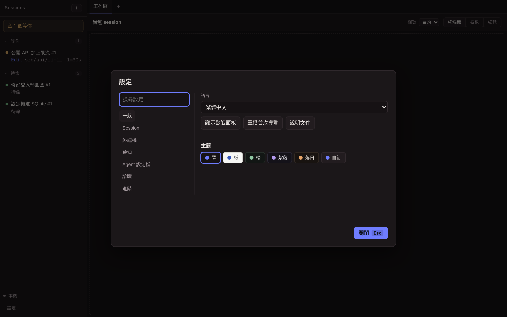

# AgentDesk

[English](README.md) · **繁體中文**

多個 coding agent session 的桌面管控台。**每個 session 就是一個真的終端機**，
跑真的 `claude`（或 codex / gemini / aider），畫面跟你在 Terminal.app 裡開的
一模一樣：同樣的 TUI、同樣的 `/` 選單、同樣的權限提示。App 不重繪、不重新
詮釋任何東西。

它補上的是終端機分頁給不了的東西。每張卡片有自己的 git worktree，所以同一個
repo 上的兩個 agent 不會互相踩到。每個 session 會回報自己是不是卡在你身上，
所以唯一值得知道的那個數字就在畫面上。而整件事跑在跟你的 shell 一樣的環境
裡，所以 agent 找得到的工具跟你一樣。



---

## 導覽，一個功能一支短片

### 分流

某張卡轉成琥珀色。桌上不會有別的東西這樣跳動，所以不需要閱讀。
`⌘/Ctrl+E` 把你放進那個 session 的終端機，游標已經在裡面。


### 開卡

`⌘/Ctrl+K` 打開時，等你的 session 已經列在那裡，你一個字都還沒打：
它首先是待辦收件匣，其次才是搜尋框。改成打一句話，它就變成一張卡。


### 開始 attempt

對話框攤開組好的完整 prompt 而且可以改，所以跑的就是你讀過的。權限模式在
這裡決定，只作用於這一次 attempt。開始之後會開一個隔離的 worktree，和一個
真的終端機。


### 檢視

diff 開在活著的終端機**旁邊**，不是取代它。點某一行附上意見，整批走 session
自己的輸入送回去，所以 agent 收到的是一份 review，不是一串碎片。


### 自己在 diff 裡改掉

review 迴圈最常見的收尾是一行小修，所以 diff 直接讓你修。`✎` 把檔案就地
展開成編輯器，存檔寫進 attempt 的 worktree，接著遞上一則寫明檔名的
「告訴 agent」訊息。


### 它知道什麼

在任何人打字之前 agent 就已經讀過的東西：規則檔與 skills，來自這份 checkout
與這台機器。不存在的也列出來，因為「這裡沒有 CLAUDE.md」正是你來找的答案。


### 設定

用它在畫面上叫什麼去搜，而不是記得它在第幾層抽屜。刻意不存在的設定，就在
你找它的地方說明為什麼不存在。


---

## 其他畫面

<details>
<summary>總覽、命令面板、檢視器、時間軸、終端機牆</summary>

**總覽。** 所有 session 一次看完，依它需要你做什麼分組；超過一台機器時再按
機器分開。



**命令面板。** 等你的最前，然後是完成未看的，再來是卡片與動作。



**檢視器。** diff 就地展開成編輯器（base 唯讀嵌在行間、worktree 側可改）、
這個 attempt 的 token 帳、一則待送的 review 留言，以及點擊前就先跑好的合併
檢查。



**活動與檢查點。** agent 做了什麼，按工具摺疊起來，每一輪之前的等待都標出
花了多久。每個 prompt 列都戴 `↩`，把程式碼還原到那一輪之前。



**終端機牆。** 每個 session 都是真的 PTY：真的 Claude Code TUI 一個像素不差，
旁邊是一般的 test runner。



**設定。** 分區、搜尋，以及那些拒絕。



</details>

---

## 裡面有什麼

- PTY session：真的 pseudo-terminal 跑真的 agent CLI，xterm.js 渲染
- login-shell 環境解析，agent 拿到的 PATH 跟你終端機一樣
- SQLite session 清單，跨重啟保留；重開會 `--continue` 接續該目錄的對話
- 多個工作區分頁，各自保留自己的佈局與 scrollback
- 任意 agent CLI 加任意啟動參數，原封不動傳過去
- **狀態偵測與通知**：靠 Claude Code hooks，不解析 ANSI。左上角顯示
  「⚠ N 個等你」，被擋住的 session 會發系統通知
- **任務與 attempt**：一張卡可以開多個 attempt，每個有自己的 git worktree
  與分支，同一個 repo 上的兩個 agent 互不干擾。收尾時 diff 先凍結進資料庫，
  再把 worktree 還回去
- **看板**：四欄、卡片可拖曳。卡片帶著自己的即時狀態，所以一張待在「進行中」
  的卡可以亮起「⚠ 等你授權」，點下去直接進那個 session 的 TUI。每張卡片一樣
  高，所以卡片在你眼前變化時，看板仍然掃得動。另有臨時 session 區，在看板
  之外，沒有 worktree 也沒有生命週期
- **變更與活動**：TUI 旁邊的抽屜，不進終端機就能說出這個 attempt 改了什麼
  （含未 commit 與新建檔）、做了什麼
- **收尾與併發**：合併回 base、push 並開 PR、丟棄。同時執行數有上限（預設
  3），超過的卡片排隊，額度一放出來自己起跑
- **檢視迴圈**：在 diff 裡點某一行、附上意見，整批一次送回還開著的 session，
  走 session 自己的終端機（bracketed paste），所以多行意見是**一則**訊息，
  時間軸也記下實際問了什麼。沒實測過輸入慣例的 CLI 拿到的是「複製」而不是
  「送出」，跟首則 prompt 同一套誠實。合併某個 attempt 時，同卡其他還開著的
  attempt 自動標為已被取代，diff 凍結保留，方便事後比較兩個 agent 的做法
- **Workspace scripts**：新開的 worktree 只是個 checkout，不是能跑的工作區。
  `.agentdesk/config.json` 說明它怎麼長成一個（見下）
- **權限模式**：每個 attempt 可以選 Claude Code 要照常詢問、自動接受檔案編輯
  （`--permission-mode acceptEdits`），或全自動不再詢問
  （`--dangerously-skip-permissions`）。安全論證就是 worktree，所以這個選項
  只存在於 attempt，臨時 session 永遠沒有。模式在開始對話框核准一次，排隊與
  resume 都會沿用；session 全自動跑著的時候，卡片一直掛著 ⚡ 徽章
- **具名設定檔**：profile 就是幫「這個 CLI、每次都帶這些參數」取一個名字，
  例如 `opus 版` 代表 `claude --model opus`。記錄與 resume 用的都是底下真正
  的 CLI，所以 prompt 遞送、狀態 hooks、權限模式全部照實際跑的東西判斷
- **跨 session 互傳訊息，用卡片名字**：Claude Code v2.1.224+ 讓同一台機器上
  的 session 可以互傳訊息，而 AgentDesk 的每個 session 都是真的 `claude`，
  所以卡片之間本來就通。桌面補上的是名字。CLI 自己會用 worktree 目錄名幫
  session 取名，一串 slug 加編號，所以 AgentDesk 改用 `--name` 把 session
  命名成它自己的標題，於是一張卡的 agent 可以用「修好登入 #1」這種人會說出
  口的名字去找另一張卡的 agent。送出的訊息會落在活動時間軸上。啟動時探測
  一次 `claude --version` 做版本閘門，因為舊版 CLI 遇到不認識的 flag 會直接
  拒絕啟動
- **活得比 app 久的 session**：在本機，agent 的 session 由 `tmux` 扛著，
  一個 session 一個 socket。關掉 AgentDesk 是斷開，不是殺掉。重開卡片會接回
  那個一直在跑的 agent（見下）
- **WSL 橋接**：卡片的 repo 可以住在 WSL distro 裡，一切就在 repo 所在的
  世界執行
- **SSH host**：同一道接縫，跨一條線，用的是你自己 `~/.ssh/config` 裡的
  `Host` 別名
- **中英雙語**：跟隨系統語言，也可以在設定裡手動切換。系統原生通知會跟著換

尚未做：系統匣。

---

## 活得比 app 久的 session

本機的 agent session 跑在 `tmux` 裡，一個 session 一個 socket
（`agentdesk-<desk>-<session>`）。關掉 AgentDesk 只是斷開 client，agent 繼續
跑。重開卡片接回的是那個從來沒停過的行程，包括做到一半的那一輪。

四個值得點名的判定：

- **`new-session -A -D` 就是 create-or-attach**，所以「第一次開」和「重啟後
  接回」是同一條程式碼路徑，兩者不可能對不上。
- **退出 app 是斷開；關閉 session 才是銷毀。** 這個區別就是整個功能：退出
  不等於做完了。
- **只有 agent 的 session 被扛住。** run script 與 worktree shell 是你開來看
  的，跟著桌子收掉；agent 是你開來讓它跑的。
- **socket 名字帶著每個安裝自己的標籤**（data 目錄的 FNV-1a），所以一個安裝
  的孤兒清掃永遠不會殺掉另一個安裝的活 agent。

被扛住的 session 回來時叫做 **執行中，尚未回報**，而且是在第一次繪製之前用
`tmux has-session` 問過的，不是丟給背景執行緒：一個過一下才自己修正的狀態，
在一個唯一職責就是「一眼可信」的表面上是閃爍。圓點用中性色，因為那一刻我們
知道的就只有「它在跑」。

但它不會一直停在那裡。**hook 的 endpoint 跨重啟是同一個**：port 按號碼再要
一次、token 留著，所以那個 session 的 plugin 設定裡烤進去的 URL 仍然打得到，
agent 的下一個事件就會把真的狀態放回那一列。要「endpoint 穩定」而不是「URL
做間接層」，正是因為它被烤進去了：除了 `SessionStart` 之外全都是 `http`
hook，`url` 是一個死字串、後面沒有 shell，而 Claude Code 只在 session 開始時
讀一次那個檔。對一個已經在跑的 session 來說，那個檔是照片，不是指標。

兩個值得點名的後果：

- **重新接上不等於啟動。** `new-session -A -D` 是接回正在跑的 agent，argv 直接
  丟掉，所以不會再有 `SessionStart`。在那裡宣稱「啟動中」，就是狀態標籤以前說
  過的同一個謊、從另一面再說一次，而且永遠不會自己修正。
- **如果那個 port 被占走了**（另一個 AgentDesk，或任何別的程式），就換一個新
  的，而上一輪留下的 session 會安靜到它自己結束為止。那正是「還沒有記住
  endpoint」之前的狀態，所以它是降級，不是拒絕啟動。

尚未做：WSL 與 SSH 世界的同一件事。

---

## 讓 worktree 開箱能跑

在 repo 放一個 `.agentdesk/config.json`，每個 attempt 的 worktree 就會自己
準備好：

```json
{
  "setup": "npm install && cp \"$AGENTDESK_ROOT_PATH/.env\" .env",
  "run": [
    { "name": "dev", "command": "npm run dev -- --port $AGENTDESK_PORT" },
    { "name": "test", "command": "npm test -- --watch" }
  ],
  "archive": "docker compose down"
}
```

`setup` 在 agent 起跑前執行，跑在同一個終端機裡，所以輸出跟失敗都在你正在
看的地方。`run` 的每一項變成抽屜裡的 ▶ 按鈕，在該 attempt 自己的 worktree
裡開 dev server 或 test watcher，`$AGENTDESK_PORT` 帶一個沒人占用的埠。
`archive` 在 worktree 被收回之前執行。每個 script 都看得到
`$AGENTDESK_ROOT_PATH`，也就是 worktree 是從哪個 repo 開出來的，`.env` 這類
沒進版控但值得複製的檔案就在那。

Script 都走 `sh -c`，寫法跟在終端機打一行一樣。檔案格式錯誤會讓 attempt 在
對話框裡就開不起來，而不是安靜地什麼都不做：一個安靜失效的設定檔，跟一個
壞掉的 worktree 從外面看是分不出來的。（目前僅支援 POSIX 平台。）

---

## 執行

需要 Node 20+、Rust stable，以及你要用的 agent CLI 已安裝並登入。

```bash
npm run setup
npm --prefix ui run dev &                       # vite on :5173
cargo run --manifest-path src-tauri/Cargo.toml
```

`cargo` 若不在 PATH，先 `source ~/.cargo/env`。要永久生效，把這行加進
`~/.zshrc`：

```sh
export PATH="$HOME/.cargo/bin:$PATH"
```

### 迴圈周邊

撐起 triage 迴圈的各個部件，大致依你遇到它們的順序：

- **首次啟動** 會落在看板上，空的 backlog 欄就是入口。歡迎面板回報這台機器
  實際裝了哪些 agent CLI，並用看板自己的點形畫成三點軌，講完卡片 →
  attempt → 收尾這條模型。PATH 上一個 agent CLI 都沒有的機器，拿到的是誠實
  的琥珀色死路加一顆「重新偵測」chip，不是一片開朗的空白。面板隨時能從命令
  面板或設定重開，重開就重新探測，不重播舊答案。之後五個一次性的 coach mark
  會在某個介面第一次派上用場時指出它，然後永遠閉嘴。第五個教的是琥珀色呼吸
  與 `⌘/Ctrl+E`，出現在第一次有 session 從「在做」轉成「等你」的時候。第一個
  session 開起來之前，空的終端機牆顯示一張三列的按鍵卡，不留白。
- **未讀層。** session 在終端機不在你眼前時完成一輪，側邊欄、分頁徽章、總覽
  都會掛上未讀點，直到那個終端機真的出現在螢幕上。
- **側欄分區。** 等你（與 ⚠ 徽章數的是同一批）最上，然後開發中、待命、已完成。
  待命獨立成區：一輪結束是輪到你，但沒有東西卡在你身上。
- **看板即時預覽。** 選中卡片就在欄位旁邊顯示它真正的終端機，進去之前唯讀，
  所以「它現在到底在幹嘛」只花一次點擊，不用切頁。
- **檢視器**（`⌘/Ctrl+I`）。attempt 的 diff 有逐檔已讀、換行、檔案跳轉、可調寬
  的抽屜；時間軸把同工具連跑摺疊起來、標出每次等待花了多久；shell 分頁在
  attempt 的 worktree 裡開一個真的終端機；還有從 git 讀出來的下一步建議，只在
  輪得到人做決定時出現。
- **佇列 follow-up。** agent 回合進行中寫的回饋會先扣住，回合結束後合成一則
  送出。banner 會寫明佇列裡有什麼，一鍵取消。
- **檢查點。** 有便宜的退路，才敢放手讓 agent 跑：最壞的結果只值一次點擊時，
  讓它自己做完就容易得多。每輪結束把 worktree 快照進私有 ref（預設開，設定
  裡可關），agent 看得到的一切原封不動；另有 ⚑ 手動快照，任何 agent 都能用。
  時間軸的 prompt 列戴 `↩`：把程式碼還原到此輪之前。對話永不觸碰、還原前先
  自動快照、回合進行中會拒絕並說明理由。diff 可改以任一檢查點為基準比較。
  refs 隨 attempt 終局刪除，凍結 diff 從此是唯一紀錄。
- **暫停。**「現在不做」不等於「不做了」：對安靜下來的 attempt 按暫停，
  worktree 與併發槽還回去，分支、檢查點、對話全部留著（分支名同時進剪貼簿）。
  繼續時 worktree 在原路徑長回來、暫停時的工作原樣還原，`--continue` 接上原本
  的對話。
- **一張卡一個大聲的動作。** 停下來的卡片只讓「繼續」大聲，暫停與換 agent 要
  對準了才現身；合併完的卡片上「再試一次」不再壓過它底下那場勝利。檢視器的
  五顆工具 chip 也因為同一個理由收成一條有標籤的 worktree 帶：五個一樣大聲，
  等於沒有層次。
- **Dev server 預覽。** ▶ run script 起的頁面直接掛在桌邊：iframe 顯示的就是
  server 送出的樣子，不代理、不注入。server 死了面板會說，不留白框。repo 自掛
  inspect script（`docs/examples/agentdesk-inspect.js`）後，Alt+click 任何元件
  就變成「{component} · {file}:{line}」，一鍵送進 agent 的終端機。
- **Token 帳。** 每個 claude session 的花費與語境水位，每回合結束從它自己的
  transcript 讀一次（路徑由 hooks 遞來，回合中不輪詢）。檢視器顯示
  「語境 279k · ↑2.6M」，hover 給四欄精確值。只給 token、不給金額或百分比：
  價目表會過期，沒量測過的 context window 是發明出來的分母。
- **終端機搜尋**（`⌘/Ctrl+F`）。用浮層搜 10k 行捲動歷史；Enter 與 Shift+Enter
  走上下一個，找不到會直說。終端機內改用 Ctrl+Shift+F，因為 Ctrl+F 屬於
  readline。輸出裡的網址用 ⌘/Ctrl+click 開啟。
- **分支挑選。** 開卡對話框直接建議 repo 的分支、按最近使用排序，而不是要你
  憑記憶打字。標題可以不填：留白就用 prompt 的第一行，這是對話框明講的規則，
  不是碰巧的預設。
- **世界。** 左下角的切換決定新東西開在哪（WSL distro 與 SSH host 用枚舉的，
  不發明），點選就地探那個世界的 `claude`。走 WSL 或 SSH 的 repo 會在卡片上
  戴 host 徽章；總覽在超過一個世界時按機器分組。
- **無訊號 chip。** 狀態來自 Claude Code 的 hooks；跑其他 agent 的卡片會直說
  「無狀態訊號」，不讓安靜被讀成沒事。

### 鍵盤

最高頻的迴圈，agent 等你、你授權、繼續下一個，不用碰滑鼠。`⌘/Ctrl+/` 會在
app 裡顯示這份清單：

| 按鍵 | 動作 |
|---|---|
| `⌘/Ctrl+E` | 在等你的 session 之間循環 |
| `⌘/Ctrl+K` | 命令面板：等你的 session 最前，然後是卡片與動作 |
| `⌘/Ctrl+Shift+N` | 直接開新卡對話框 |
| `⌘/Ctrl+Enter` | 送出打開中的建立對話框。IME 選字的 Enter 絕不誤送 |
| `⌘/Ctrl+1` `2` `3` | 終端機牆 · 看板 · 總覽 |
| `⌘/Ctrl+Alt+←` `→` | 聚焦下一個 / 上一個 pane |
| `⌘/Ctrl+←` `→` `↑` `↓` | 搬動聚焦的卡片：左右換欄、上下換位 |
| `Ctrl+PgDn` `PgUp` | 下一個 / 上一個分頁 |
| `⌘/Ctrl+I` | 開關檢視器 |
| `⌘/Ctrl+,` | 設定 |
| `J` `K` | 在 diff 行之間移動；`Enter` 對該行留言 |
| `N` `P` | 在 diff 檔案之間移動；停在檔頭時 `e` 就地展開編輯器、`v` 標該檔已看 |
| `Esc` | 關閉打開的對話框 |
| `Tab` `Enter` | session 列、看板卡片、diff 行都可聚焦；Enter 執行 |

在終端機裡，app 的快捷鍵要多按 Shift，也就是 `Ctrl+Shift+E` 而不是
`Ctrl+E`，就像 `Ctrl+Shift+C` 是複製一樣。那裡的 `Ctrl+字母` 屬於 shell。

已輸入文字的對話框會忽略誤點 backdrop（Escape 仍然關得掉）；刪除卡片要按
兩下，第二下會用文字說明它要做什麼。

焦點用交的，不用丟的：命令面板落在它點名的那張卡上；開新卡會切到看板、聚焦
新卡並唸出來；從空的終端機牆合併，焦點落在剛裁決完的卡片上；送出 review
批次之後，游標交還給 diff。

### 螢幕閱讀器

終端機用 GPU（WebGL）渲染，畫出來的是螢幕閱讀器讀不到的像素。設定裡有一個
可選的終端機螢幕閱讀器模式，用 DOM 渲染器把它換掉：終端機文字（含權限提示）
變得可讀，代價是大量輸出時捲動沒那麼順。這筆交換就寫在設定自己的說明文字裡，
因為宣稱無代價的無障礙模式，必然對其中一邊說謊。

周邊會說話的部分：卡片的標籤唸得出權限模式，全自動跑的 session 絕不會被聽成
有人看著的那種；回合結束透過 live region 播報；每顆圖形按鈕都有真名字；分隔
軸把真實數值交給輔助技術；世界選單可以用方向鍵走。

### 通知

session 開始等你（權限確認、資料夾信任）而視窗不在前景時，OS 會用 app 的語言
跳出通知，dock 或工作列圖示會掛上等待數（macOS 與 Linux）。視窗在前景時 app
內的 banner 已經說了，OS 就保持安靜。

設定裡可以選哪些類別要發：授權與信任確認、等你回覆、完成一輪。還有一顆測試
按鈕，因為發現通知設定壞掉的那一刻，不該是 agent 已經卡住的那一刻。

### 主題

五個預設主題：墨（預設）、紙（淺色）、松、紫藤、落日，加上自訂模式。自訂主題
只問六個真正載義的顏色（背景、文字、強調色、成功/警告/錯誤），中間的層次自動
推導。編輯器會即時顯示每一層文字對照它實際所在底色的 WCAG 對比，4.5:1 是 app
對自己保持的樓地板。終端機跟著主題換裝，淺色主題用淺色 ANSI 色盤。選擇存在
本機。

---

## 測試

```bash
cd src-tauri && cargo test      # PTY、hooks、worktree、attempt、timeline、queue、migration、規則、儲存
npm --prefix ui run test:e2e    # Playwright：前端 + 看板 + 檢視抽屜 + 佇列 + xterm 渲染 + journeys
```

macOS 的 WKWebView 沒有 WebDriver，所以 Playwright 是在 Chromium 裡跑同一份
React 樹、搭配 mock 的 Tauri IPC。它涵蓋 IPC 邊界以上的一切：session 清單、開新
session 的流程，以及 xterm 對**真實 PTY bytes** 的解碼與渲染。

測試驗的是會決定體驗真偽的性質，不是「有沒有輸出」：

- `tests/pty.rs`：子行程在 tty 上（所以 CLI 進互動模式，不是降級的
  non-interactive），以及它拿到的是 login shell 的 PATH 而不是 GUI stub
- `tests/hooks.rs`：完整鏈路 PTY → 真的 `claude` → plugin hook → curl →
  HTTP listener，且 session id 正確對應。不需要花錢的 API call
- `ui/tests/fixtures/claude-tui.json`：從 PTY 擷取的真實 Claude Code TUI 輸出，
  **刻意從一個多位元組字元中間切成兩塊**。有一個對照測試證明這份 fixture 用逐
  chunk 解碼確實會壞掉，所以主測試不會因為錯的理由而通過
- `tests/prompt_injection.rs`：在一個真的、沒被信任過的新 worktree 裡跑真的
  `claude`，數 `UserPromptSubmit` hook 觸發幾次。多行 prompt 必須是**一則**
  訊息，不是一行一則
- `tests/worktree.rs`：對真的 git，兩個 attempt 看不到彼此的檔案、各自的
  base_sha 不會互相飄移、worktree 收得回來、分支留著
- `tests/attempts.rs`：整條 core 流程，agent 用替身而不是真的模型。驗的是
  AgentDesk 做了什麼（開哪個 worktree、命令列長什麼樣、記了什麼、還了什麼），
  這些都不需要模型回答。替身的 log 是 NUL 分隔的，因為用一行一個參數會分不出
  「一個含換行的參數」和「好幾個參數」，而那正是這裡要驗的東西
- `tests/attempts.rs` 的時間軸段：完整鏈路 hook listener → router → channel →
  writer thread → SQLite。同時釘住不該記的不要記：連續三次 `running` 只留工具
  呼叫，不留三行狀態
- `pty.rs` 的 tmux 段：在完全沒有 client 的情況下，session 仍在、agent 程序
  仍在跑。那就是整個功能，所以直接驗它，而不是從「重新接得上」去推論
- `store.rs` 的 migration 段：三條升級路徑各一個測試，包括**沒有版本號但已經
  有 `completed` 的舊 DB**（這條沒處理好會讓每個既有安裝都開不起來）、更舊的
  沒有 `completed`、以及從上一版正常升級且資料不掉
- `ui/tests/queue.spec.ts`：排隊的卡片會自己起跑（沒有人按任何東西），以及會
  弄丟工作的合併必須被擋下來並把原因講完
- `ui/tests/board.spec.ts`：兩軸真的成立。卡片留在原欄位不動，燈號自己從
  「等你確認資料夾」→「執行中」→「⚠ 等你授權」變化；點下去之後
  **`document.activeElement` 真的落在那個 pane 裡面**，不只是 pane 有 focused
  class。拖曳測試把四個 drag 事件在同一個 tick 內送完，比真實拖曳更嚴格，
  這樣「靠 React state 剛好 render 完才會過」的實作會當場失敗
- `ui/tests/layout.spec.ts`：在七種視窗尺寸下，沒有任何東西被畫到別的東西
  上面、頁面不橫向捲動、而且沒有任何兩張卡片高度相差超過一個像素。第一條檢查
  直接說出病因（網格被壓得比內容矮）而不是只驗症狀，因為症狀要卡片夠高才看得
  見，病因永遠看得見
- `ui/tests/i18n.spec.ts`：沒選過語言時跟隨系統、選過就以選的為準、切換當下就
  重繪且重開仍在，以及語言確實有送到後端讓原生通知跟著換
- `ui/tests/journeys/`：五條真實的使用動線從頭走到尾，不是逐個畫面戳一下。冷
  啟動的第一次使用一路走到合併；零滑鼠的 triage 日，那份 spec 裡一個 `.click`
  都沒有，鍵盤的承諾是用結構保證的；重啟復原；reduced motion 下的無障礙契約；
  以及同一條線用繁體中文再走一遍。旁邊六張視覺基準釘住關鍵畫面

兩個會去驅動真的 `claude` 的測試（`tests/hooks.rs` 與
`tests/prompt_injection.rs`）在沒有登入好的 CLI 時會自己跳過。**只檢查 `PATH`
上有沒有是不夠的**：沒登入過的 CLI 會停在歡迎畫面、永遠不會開始一個 session，
於是測試會把整個 timeout 燒完，只證明了這台機器沒登入。所以改成去讀 Claude
Code 自己的 `~/.claude.json` 裡的 `hasCompletedOnboarding`。那個 key 哪天換了
位置的話，這些測試會變成跳過而不是錯誤地通過，而且會在 stderr 說明原因。要
強制跑就 `AGENTDESK_TEST_ASSUME_CLAUDE=1`。

### README 的圖與影片

上面的截圖與短片都是真的 React 樹、真的 stylesheet，以及 xterm 渲染真的擷取
下來的 Claude Code TUI。只有後端是每個測試都信任的那份 mock，所以資料是擺
出來的，像素不是。

```bash
SHOTS=1 npm --prefix ui run test:e2e -- shots            # docs/media/*.png
CLIP_DIR=.rec npm --prefix ui run test:e2e -- clips      # 錄影
node ui/scripts/readme-clips.mjs                         # docs/media/clips/**/*.gif
```

每支短片有自己的調色盤。一支大影片共用一張全域調色盤，正是舊錄影顏色跑掉的
原因：256 個位子要同時吃下終端機的語法上色、四種狀態色，以及 diff 的紅與綠，
於是全部往當下最強勢的那一群偏移。一支短片只講一個功能，它的調色盤也就只要
裝得下一個功能的顏色。

---

## 發佈

三個平台的安裝檔由 GitHub Actions 產生（`.github/workflows/release.yml`）。

發版是一個按鈕加一個決定：**Actions → Release → Run workflow → 選 `bump`**，
`patch` 修 bug、`minor` 加功能、`major` 破壞相容。run 會自己算下一版、寫進
`tauri.conf.json`、`Cargo.toml`、`Cargo.lock`、`package.json` 四個檔案、commit
回 `main`，再從那個 commit 建四平台並發佈。沒有人手動維護版本號，所以它每一版
**必然**會動。

接著：建 draft release、四個平台平行 build、**全綠才把 release 轉正**。有平台
掛掉就停在 draft，不會出半套。版本號 guard 仍守著手動路徑：推 tag（或 dispatch
填明確的 `tag`）時，tag 跟 `tauri.conf.json` 不一致就直接失敗，免得 `v0.2.0`
的 release 裡掛著一堆 `AgentDesk_0.1.0_*`。明確的 `tag` 也是失敗重跑的路徑，
因為 bump commit 已經落地但發佈失敗時，要用已經燒掉的那個 tag 重發，不是再
bump 一次。

### nightly build

每次 push 到 `main` 都會跑同一套四平台 build，並發佈到一個 tag 為 `nightly`
的滾動 prerelease，蓋掉上一份。所以 `main` 的最新版本永遠一個連結就拿得到，
不用等誰去發版：

    https://github.com/KCL1104/agents-desk/releases/tag/nightly

它是 prerelease，而且**永遠不會被標成 latest**，不會擠掉正式版在 repo 首頁與
release API 上的位置。有平台失敗的話，那份 draft 會被丟掉、上一份 nightly
留著，不會出半套。build 途中又有新 commit 進來會直接取代它（只有最新的產物
有意義），但 tag 的 build 永遠不會被取消。

這也是為什麼 `ci.yml` 不再打包：它以前每次 push 到 main 都建三個平台，然後
整包丟掉。

沒有任何發版路徑會用 git 推 tag。tag 一律由 GitHub 在 release 發佈時建在
build 的那個 commit 上，跟 nightly 的 tag 同一套機制。兩個輸入都留空則只
build，產物掛在該次 run 的 artifacts 底下，不碰任何 release。其實每次 run
都會掛，所以正式版與 nightly 的 build 也都能直接從 run 裡下載。

| 平台 | runner | 產物 |
| --- | --- | --- |
| Linux x86_64 | `ubuntu-22.04` | `.deb`、`.rpm`、`.AppImage` |
| macOS Apple Silicon | `macos-15` | `.dmg`、`.app` |
| macOS Intel | `macos-15-intel` | `.dmg`、`.app` |
| Windows x86_64 | `windows-latest` | `.msi`、NSIS `.exe` |

Linux 建在 22.04 而不是 24.04：glibc 與 WebKit 只往前相容，24.04 建出來的東西
在 22.04 上跑不起來。`macos-15-intel` 是 Actions 最後一版 x86_64 的 macOS
image，2027 年 8 月退役，到那時候 Intel 那一列就得拿掉。

`.deb` 與 `.rpm` 的相依只有一半會自己長出來：bundler 會去讀執行檔實際連到的
so，把 `libwebkit2gtk-4.1-0`、`libgtk-3-0` 補進去。**但 `git` 不會**，它是用
`Command::new("git")` 在執行期叫的，不是連進去的函式庫，掃不到。所以那一條
寫在 `tauri.conf.json` 的 `bundle.linux.deb.depends` 裡，漏了的話裝得起來、
開下去 worktree 就爛掉。`gh` 放在 `recommends`，只有開 PR 那條路徑會用到。

### 沒有簽章

repo 裡沒有任何簽章金鑰，所以三個平台的產物都是未簽章的。使用者第一次開會被
系統擋：

- **macOS。** Gatekeeper 會說「已損毀，無法打開」。不是真的壞掉，是 quarantine
  屬性：

  ```bash
  xattr -dr com.apple.quarantine /Applications/AgentDesk.app
  ```

- **Windows。** SmartScreen 藍色視窗，「更多資訊」→「仍要執行」
- **Linux。** 不擋

要正式簽章的話，把 `APPLE_CERTIFICATE`、`APPLE_CERTIFICATE_PASSWORD`、
`APPLE_SIGNING_IDENTITY`、`APPLE_ID`、`APPLE_PASSWORD`、`APPLE_TEAM_ID` 加進
repo secrets，然後在 `release.yml` 的 build step 上把它們接成 `env`。那裡有
註解標了位置。

**刻意不預先接好。** bundler 判斷要不要簽看的是 `APPLE_CERTIFICATE`
**存不存在**，空字串也算存在，它不會去檢查有沒有值。所以在一個沒有這些
secrets 的 repo 裡去引用它們，等於把變數設成 `""`，兩個 macOS job 就會死在
`failed codesign application: failed to import keychain certificate`。要加就
跟真正的 secrets 同一次加，不要提前。

### icon

`src-tauri/icons/` 底下的 `.ico`、`.icns` 與各尺寸 PNG 都是 commit 進來的，
不是 CI 現產。Windows 要 `.ico`、macOS 要 `.icns`，少一個那個平台就打不出
安裝檔。要換圖時：

```bash
npm run tauri -- icon path/to/new-icon.png
```

它的輸出目錄預設就是 `src-tauri/icons/`，而且**會連來源的 `icon.png` 一起
覆寫**。想留著原圖就先 `-o` 到別的地方，再把需要的檔案搬回來。

---

## CI

`.github/workflows/ci.yml`。push 到 main 與所有 PR 都會跑：Rust `cargo test`、
前端 typecheck 加 build 加 Playwright、sidecar typecheck 加 build。**只管正確
性**。打包是 release.yml 的事，而且 push 到 main 那一輪會產出真的能下載的
安裝檔，而不是建完就刪掉。

`cargo fmt` 與 `clippy` **不擋 CI**，只把結果印出來。現在這棵樹還不是
rustfmt-clean，把整棵樹重排是另一件事，不該跟接 CI 綁在一起。

`npm run smoke` 沒有進 CI：它會真的開一個 Claude Code session，需要憑證。

`.github/workflows/claude-detect.yml` 守著其餘 CI 守不住的那一條承諾：app 在
真的機器上找得到真的 Claude Code。四條腿，Linux、macOS、原生 Windows、WSL 裡
的 Ubuntu，各自在真的 runner 上裝真的 CLI，然後驅動 app **自己**的解析路徑
（login-shell 探測、各平台的 PATH 走法、WSL 那道門）直到找到執行檔、並從
`claude --version` 拿到回答。每次推上 `main`、碰到 `src-tauri` 的 push 都跑，
每週一也跑，因為上游安裝器改了形狀不需要這裡有任何 commit；樹是綠的而週一
紅了，指的就是他們。

---

## 語言

介面有英文與繁體中文兩種。

開啟時跟隨系統語言（任何 `zh*` 的 locale 給中文，其餘給英文），設定裡有切換器。
在那裡選過之後，選擇一律蓋過系統設定，而且跨重啟保留。

決定權在 webview，並透過 `set_locale` 往下推給 Rust，所以那少數幾個由 OS 而
不是 webview 繪製的字串，也就是原生通知的標題與內文，會跟著一起換。與其讓兩套
偵測規則各自判斷、然後可能不一致，不如只留一套、另一邊照著做。

介面字串在 `ui/src/i18n/messages.ts`。**英文是真相來源**：它的 key 定義出
`MessageKey` 型別，中文那份被定成對這個型別的全對映，所以只加一邊、忘了另一邊
會直接 typecheck 失敗，而不是靜靜地在畫面上印出一個 raw key。Rust 自己要講的
那幾句在 `src-tauri/src/i18n.rs`。

介面只說某個控制項做什麼。它不會回頭跟你解釋 git、shell 或 CLI：錯誤訊息說出
發生了什麼就停下來，理由留在這裡和初次使用導覽裡，那是刻意只讀一次的地方，
而不是每次出錯都再講一遍。

程式碼註解**刻意留中文**。那是寫給維護的人看的，不是給使用者看的，而且裡面
裝的理由是這個 repo 最值錢的東西。翻它跟「讓產品雙語」是兩件不同的事。

---

## 狀態偵測

多開 session 時你唯一真正需要的資訊是「哪一個在等我」。取得方式是請 Claude
Code 自己回報，不是去解析畫面，因為解析 ANSI 會在 TUI 改版時無聲壞掉。

App 啟動時做兩件事：在 loopback 開一個小 HTTP listener，以及把一份只含 hooks
的 plugin 寫到資料目錄。每個 session 用 `--plugin-dir` 載入它，並注入
`AGENTDESK_SESSION_ID` 與 `AGENTDESK_HOOK_URL`；hook 是一行 `curl`，把狀態
回報回來。

| Hook 事件 | 回報狀態 |
|---|---|
| `SessionStart` / `UserPromptSubmit` / `PreToolUse` | 執行中 |
| `PermissionRequest`、`Notification`(permission_prompt) | **等你授權** |
| `Notification`(idle_prompt) | **等你回覆** |
| `Stop` | 待命 |
| `SessionEnd` | 結束 |

只有「等你授權」與「等你回覆」會發通知與計入徽章。那是 agent 真的被擋住、
沒有你就無法繼續的兩種狀態。

三個實作上的地雷（都是實測出來的，文件沒寫）：

1. **不能用 `--settings` 塞 hooks。** 它會覆蓋同名 key，等於把你自己的 hooks
   整個關掉。plugin hooks 才是附加的。
2. **`"shell": "sh"` 會讓 hook 靜默不觸發。** 沒有錯誤、沒有回報。`"bash"`
   可以，不指定也可以。有回歸測試釘住這點。
3. **hook 一定要 exit 0。** 退出碼 2 會**擋下**它所在的那個工具呼叫，所以每
   一行都以 `|| true` 結尾。app 掛掉絕不能連帶卡死 agent。

（另外三個關於 worktree 與首則 prompt 的實測結果，見下面「任務與 attempt」。）

---

## 任務與 attempt

`Task 1 ─ N Attempt 1 ─ 1 Session`。Attempt 是「用某個 agent 試做這張卡的一次
嘗試」，帶自己的 worktree 與分支；換 agent 重跑就是開新的 attempt。

狀態分兩軸，而且**軸二絕不自動驅動軸一**：

| 軸 | 內容 | 誰決定 |
|---|---|---|
| 一・任務生命週期 | `backlog → running → review → done` / `abandoned` | 只有人，用拖的 |
| 二・session 即時狀態 | 執行中 / ⚠等你授權 / ⚠等你回覆 / ⚠等你確認資料夾 / 待命 / 執行中，尚未回報 / 結束 | hook 回報 |

沿用 `store.rs` 既有的 `completed` 立場：`Stop` 只代表這一輪結束，不代表事情
做完了，所以沒有任何 hook 能搬動卡片。

worktree 放在 `~/.agentdesk/worktrees/<repo>-<hash>/<slug>-<n>/`，**不放在
repo 旁邊**。repo 的上層目錄很常自己也是一個 repo（傘狀 workspace），worktree
放進去就變成巢狀 repo，所有往上找 `.git` 的工具都會開始給出不一樣的答案。也
不放在 application support 底下：這是人會想 `cd` 進去、用編輯器打開、在裡面
跑 build 的工作目錄，「打得出來的路徑」比「整齊」值錢。

又三個實測出來、文件沒寫的事實（`tests/prompt_injection.rs` 釘住）：

4. **位置參數傳 prompt 不會退化成 print 模式**，`-p` 才會。多行字串經 argv
   傳進去是**一則**訊息，因為 argv 裡的換行是文字，不是 Enter。
5. **新 worktree 一定會撞信任對話框，而且在答完之前什麼都不會跑，
   `SessionStart` 也不會。** 所以沒有任何 hook 能回報這個狀態；core 直接標成
   `AwaitingTrust`，它有資格這樣做，因為那個目錄是它前一刻自己建的。少了這個，
   徽章就會漏掉每個 attempt 的第一個狀態。prompt 本身能活過對話框，答完就
   送出。
6. **`$SHELL -ilc` 會繼承 AgentDesk 自己的環境。** 從 Finder 啟動時那是乾淨
   的，從 Claude Code session 裡的終端機啟動就不是，因為
   `CLAUDE_CODE_CHILD_SESSION` 會關掉 transcript 儲存，於是 `--continue` 沒有
   東西可以接，重開 attempt 會無聲地從頭開始。`shell_env` 會把這類 session
   marker 拿掉，但**只拿掉明確列出的那幾個**：`CLAUDE_CODE_*` 底下也住著
   `CLAUDE_CODE_USE_BEDROCK` 這種真的使用者設定，用前綴一律砍會把別人的環境
   弄壞。

首則 prompt 只注入 agent 自己發現不了的事：這是為這張卡開的 worktree、分支是
哪個、從哪個 base 開出、commit 在這個分支上。CLAUDE.md、skills、MCP 都會原生
載入，不重複塞。模板在 `<data_dir>/prompt-template.md`，可以改，升級不會蓋掉。
開 attempt 的對話框顯示完整 prompt 且可編輯，送出什麼就記什麼。

非 Claude 的 agent 不自動送 prompt：那些 CLI 的參數慣例沒有實測過，而在某個
CLI 裡代表「這是你的 prompt」的參數，在另一個裡可能代表「印出來然後結束」。
猜錯比不猜更糟，所以 UI 顯示組好的 prompt 讓人一鍵複製。

---

## 架構

```
Tauri 視窗 (React + xterm.js)
      │  invoke: term_write / term_resize
      │  event:  term:output
Rust 核心  ── PTY registry · session 清單 · SQLite
      │  portable-pty（本機 agent 由 tmux 扛著，一個 session 一個 socket）
  claude / codex / … × N
```

核心（`src-tauri/src/core.rs`）不依賴 Tauri，只透過 `UiSink` trait 對外，
之後要加 axum websocket 讓瀏覽器或遠端連進來不必重寫。

### 為什麼要 login-shell 環境解析

從 Finder 或 Dock 啟動的 GUI 程式拿到的是精簡環境：`PATH` 大約只有
`/usr/bin:/bin:/usr/sbin:/sbin`，沒有 nvm/mise/asdf 的 shim、沒有 Homebrew
前綴、沒有你 export 的 API key。把這種環境交給 coding agent，`npx` 型的 MCP
server 起不來，常常連 agent 本身都找不到。

`shell_env.rs` 啟動時跑一次 `$SHELL -ilc 'env -0'`，用你自己 shell 的環境去生
所有 session。設定裡的診斷分區會顯示解析結果，降級時也會明講。

同一套解析在原生 Windows 上曾經因為另一個理由失效：那邊的環境變數 key 不分
大小寫，而 registry 寫的是 `Path` 不是 `PATH`，照字面找就什麼都找不到，整台
機器看不到 `claude`，也看不到其他任何東西。v0.3.1 起改成按 Windows 自己的
規則、不分大小寫地讀。

### 終端機輸出是 bytes，不是字串

PTY 的讀取邊界落在核心決定的位置。在 Rust 端對每個 chunk 做 UTF-8 解碼，會把
任何跨越邊界的多位元組字元換成 U+FFFD，而 TUI 滿是 3 bytes 的框線字元，畫面
就會沿著 chunk 邊界裂開。所以輸出以 base64 傳遞，交給 xterm 自己有狀態的解碼
器把邊界縫回去。

同理，`lineHeight` 必須正好是 1。大於 1 會在列與列之間留下空隙，框線字元就接
不起來。

### PTY 開始輸出的時間早於 pane 掛載

PTY 一 spawn 就開始吐 bytes，但顯示它的 pane 要等下一次 render 才存在。中間的
輸出，對 Claude Code 來說是整個開場畫面，就會發給沒有人，pane 一片空白。

所以 Rust 端為每個 session 保留一份有上限的 scrollback 與序號。pane 掛載時：
先訂閱（才不會漏），再取快照，然後寫入快照、接著只重播序號比快照新的即時
chunk。順序反過來會漏掉中間的；不比對序號則會寫兩次。

同一套協定也正是「接回被 tmux 扛住的 session」能成立的原因：晚到的 pane 就是
晚到的 pane，晚一次 render 和晚一次 app 重啟並無不同。

### 為什麼是 PTY 而不是 Agent SDK

先做過 SDK 版本：結構化事件、原生訊息串與工具卡片、`canUseTool` 攔截權限請求
彈原生對話框。功能更多，但**畫面就不是終端機了**。既然目標是「跟終端機一樣」，
PTY 是唯一能保證這件事的做法，因為 TUI 自己畫，我們只負責把 bytes 搬過去。

SDK 版本的程式碼收在 `src-tauri/parked/`（Node 那半在 `sidecar/`），沒有刪掉。
如果之後需要攔截而不只是承載工具呼叫，例如無人值守的背景模式或政策層，那份
程式碼是可用的起點。

---

## 已知限制

- 收尾就到「合併」與「開 PR」為止。PR 的 review、留言、CI 紅綠、合併按鈕都
  不做。那是另一個大得多的工具，硬做只會把這裡最深的東西稀釋掉
- 狀態偵測只對 Claude Code 有效。其他 CLI 沒有等價的 hook 機制，會顯示為
  「執行中 / 已關閉」而已。首則 prompt 也只對 Claude Code 自動送出，其他
  agent 會把組好的 prompt 顯示出來讓你自己貼（見上）
- 第一次在某個目錄開 session 時，Claude Code 會問你信不信任這個資料夾。這是
  它原本的行為，刻意不繞過。**每個 attempt 都是新目錄，所以每個 attempt 都會
  遇到一次**
- scrollback 不持久化，跟真的終端機一樣。對話歷史由 agent 自己存（Claude Code
  在 `~/.claude/projects/`），重開時靠 `--continue` 接回去
- **設定 outcome 是終局動作**：worktree 會被移除，所以那個 attempt 不再有活的
  TUI。留下來的是時間軸與一份凍結的 diff。superseded 的 attempt 也一樣，
  「保留可回看」指的是唯讀回看，不是還能跳進去打字
- 「活得比 app 久」目前只有本機。repo 在 WSL distro 或 SSH host 上的卡片，
  app 一關還是會停，要按繼續。被扛住的 session 在它的 agent 送出下一個 hook
  事件之前都顯示為 **執行中，尚未回報**；如果那個 agent 正停在提示符前等人，
  那可能要等到你打字為止

---

## 授權

Apache-2.0，全文在 [LICENSE](LICENSE)。
